# 🌽 玉米霉变检测 — 项目版本演进全记录

> 从 Faster RCNN 到 YOLOv8，6 版本迭代的真实踩坑与优化之路

## 项目背景

- 此项目为本人从数据采集、模型训练、项目发布全程一人负责完成，项目始于2024年8月初完结与2024年10月，本仓库为复现版本。
- 项目需求很简单：
  * 视觉模型能区分出健康和发霉的玉米粒；
  * 收购玉米粒时，每次定量抽检，模型能算出发霉玉米粒和整体玉米粒的占比，从而决定收购的价格。要求轻度发霉不高于**7%**，重度发霉不高于**2%**，整体霉变率不高于**5%**。

**行业痛点**：yx饲料厂在收购玉米原料时，需要判断玉米籽粒的霉变率来决定收购价格和是否收购。传统方式是收购员肉眼观察、牙咬判断，效率低、主观性强、无可追溯记录。

**项目目标**：用深度学习自动检测玉米籽粒霉变，实现从拍照到出霉变率的全自动化，为饲料原料品控提供客观、可追溯的 AI 解决方案。

**核心约束**：
- 需要在普通手机上实时推理（iOS / 鸿蒙）
- 模型大小需控制在 5MB 以内
- 收购现场网络不稳定，必须离线运行

## 最终方案速览

| 版本 | 模型 | 类别数 | mAP50 | 核心改进 |
|:---|:---|:---|:---|:---|
| v1 | Faster RCNN | 3 | ~0.242 | 基线，发现健康样本噪声 |
| v2 | Faster RCNN + Focal Loss | 3 | ~0.263 | Focal Loss 微调，治标不治本 |
| v3 | YOLOv8n | 2 | 0.263 | 轻量化，速度大幅提升 |
| v4 | YOLOv8n 优化 | 2 | 0.273 | 修复数据泄露，加背景图 |
| v5 | YOLOv8 + 固定相机 | 2 | 0.902 | 硬件标准化采集 |
| **v6** | **YOLOv8 + 量化部署** | **2** | **0.934** | **数据增强 + 空背景负样本，最终上线版** |

## 阶段一：Faster RCNN 探索期（v1–v2）

### v1：Faster RCNN baseline — 健康样本成了最大噪声

- 本着先“广泛试错”，再“精确迭代”的推进思路，v1的基线模型用的是FasterRCNN跑的。

**实验过程**：
- 1、训练数据的收集：由于收购玉米的同事并没有系统的收集和拍摄过发霉的玉米粒，最初的训练集照片都是在网上收集的。
- 2、训练集的标注：使用Label Studio，将轻度霉变、重度霉变的玉米粒全部标注出来，健康的玉米粒则标注过半数，剩下健康样本的交给模型去预测（如下图所示）

| 标注 | 示意 |
|:---|:---|
|  |  | 

- 3、霉变率的计算思路：模型识别出所有的玉米粒并统计数量，用霉变的玉米粒数量➗总数量。

**实验配置**：
- 模型：Faster RCNN + ResNet50-FPN
- 类别：3 类（健康、轻度霉变、重度霉变）
- 数据集：210 张（健康 60 张，霉变 150 张），数据增强后约 800 张

**实验结果**：
- 轻度霉变召回率：**仅 6.6%**（漏检率 93.4%）
- 健康样本召回率：62.4%，但 33.6% 被误判为背景
- 重度霉变召回率：55.9%，误检率最低
- 整体 mAP50：~0.242

**问题分析**：
- 轻度霉变与健康玉米外观高度相似，模型几乎无法区分
- 健康样本多样性高，模型倾向于将其归为背景，而非误判为霉变
- 轻度霉变样本内部差异大（霉变面积 5%~40%），模型难以统一建模

- 训练指标如下图所示

| v1实验 | 指标图 |
|:---|:---|
| 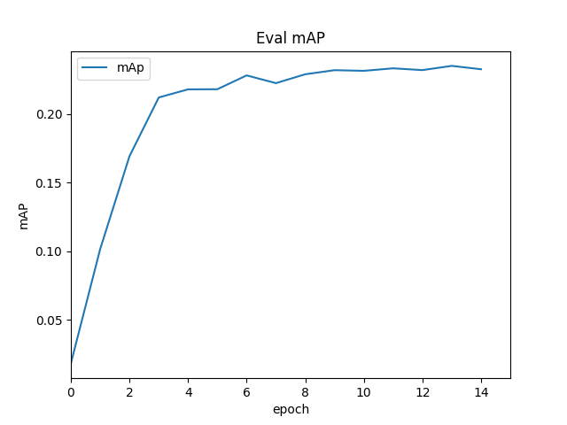 | 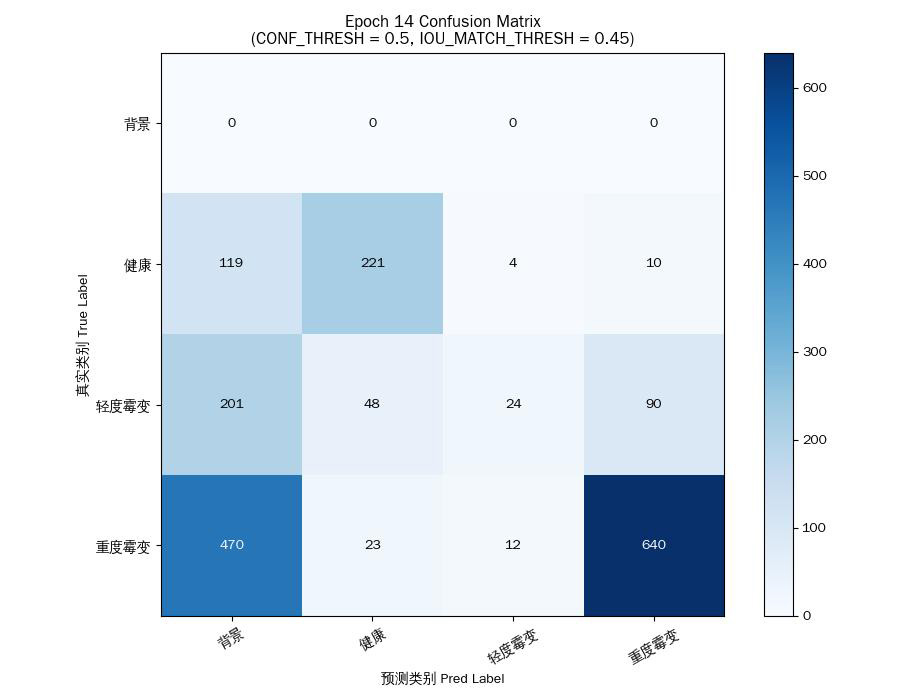 |

**核心教训**：
- 在 3 类目标检测中，轻度霉变是最薄弱环节。健康样本的多样性导致模型无法有效学习"何为健康"，反而让轻度霉变在特征空间中与健康/背景高度重叠。
- 轻度霉变是三类检测中最难区分的类别。 它的视觉特征与健康玉米高度重叠，模型既无法准确定位，也无法稳定判断程度。
- 重度霉变的视觉特征与健康差别最大，模型对它的识别最有信心。即使存在严重漏检，其精确率（Precision）也相当高。

### v2：引入 Focal Loss — 治标不治本

**改进点**：Confidence Threshold 降至 0.3，改用 Focal Loss

**实验配置**：
- 模型：Faster RCNN + ResNet50-FPN
- 损失函数：Cross Entropy Loss → Focal Loss（γ=2, α=0.25）
- 类别：3 类（健康、轻度霉变、重度霉变）
- 置信度阈值：0.3
- 数据集：与 v1 相同

**实验结果**：

| 指标 | v1 | v2 | 变化 |
|:---|:---:|:---:|:---:|
| 整体 mAP50 | ~0.242 | **~0.263** | ↑ +0.021 |
| 健康召回率 | 62.4% | **65.1%** | ↑ +2.7% |
| 轻度霉变召回率 | 6.6% | **36.9%** | ↑ +30.3% |
| 重度霉变召回率 | 55.9% | **65.8%** | ↑ +9.9% |

**混淆矩阵（v2，Conf_Thresh=0.3）**：

| 真实类别 | 背景 | 健康 | 轻度霉变 | 重度霉变 | 召回率 |
|:---|:---:|:---:|:---:|:---:|:---:|
| **健康** | 111 | **233** | 4 | 10 | **65.1%** |
| **轻度霉变** | 101 | 48 | **99** | 20 | **36.9%** |
| **重度霉变** | 353 | 23 | 10 | **744** | **65.8%** |

| v2实验 | 指标图 |
|:---|:---|
| 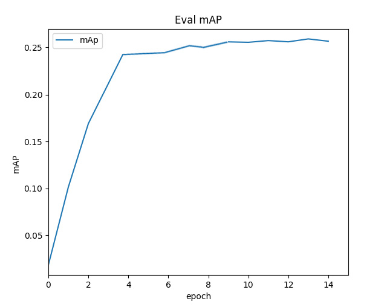 | 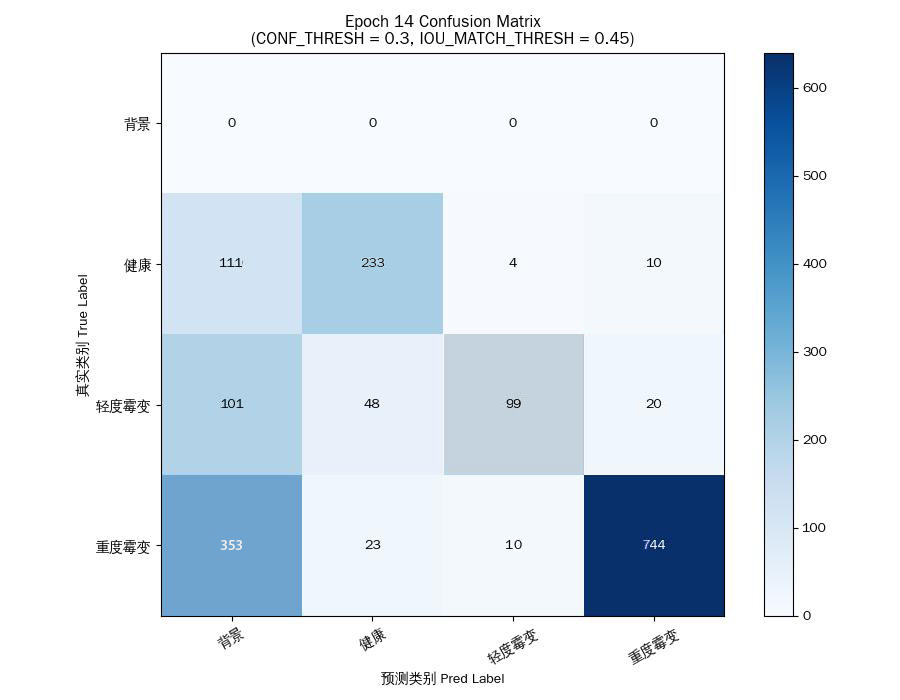 |

**mAP 收敛曲线**：
mAP 从第 8 个 epoch 开始逐步爬升，到第 14 个 epoch 约 0.26，整体呈现上升趋势但增速放缓，表明模型仍有学习空间，但增益已非常有限。

**问题分析**：

1. **轻度霉变改善显著，但仍为短板**：召回率从 6.6% 跃升至 36.9%，提升了 30 个百分点，说明 Focal Loss 确实让模型更加关注难分类的轻度霉变样本。但仍有 63.1% 的轻度霉变样本未被正确识别：
   - 37.7%（101 张）被误判为背景 → 模型仍然"看不见"部分轻度霉变
   - 17.9%（48 张）被误判为健康 → 轻度霉变与健康在特征空间中仍有大面积重叠
   - 仅 7.5%（20 张）被误判为重度霉变 → 至少模型不会把轻度过度放大

2. **重度霉变稳定提升**：召回率从 55.9% 提升到 65.8%，误判为轻度和健康的比例极低（合计不到 3%）。说明 Focal Loss 让模型对重度霉变的识别更充分，且判断准确。

3. **健康样本变化不大**：召回率 65.1%，31.0%（111 张）被误判为背景，模式与 v1 基本一致——模型倾向于忽略健康样本而非误判为霉变，这反而是好事（至少不会把好玉米当成坏玉米）。

4. **mAP 仍然偏低**：0.263 的 mAP50 虽然比 v1 有提升，但离实际应用仍有巨大差距。轻度霉变 36.9% 的召回率意味着每 3 颗轻度霉变玉米粒中就有近 2 颗被漏检。

**核心教训**：

Focal Loss 通过降低易分类样本（背景、健康）的损失权重，让模型更关注难分类样本（轻度霉变、重度霉变），确实带来了全面改善，尤其是对轻度霉变（↑ 30.3%）。但即便如此，轻度霉变召回率也仅为 36.9%——**算法优化只能缓解问题，无法根治问题**。

v2 验证了一个关键结论：**轻度霉变与健康玉米的视觉特征高度重叠，是数据集本身的结构性问题。** 模型在特征空间中无法建立清晰的决策边界，无论 Loss 怎么设计，这个边界就是模糊的。当数据本身的区分度不足时，算法的优化空间是有限的。

这也直接推动了后续版本的决定：
- **丢掉健康类别**——既然健康与轻度霉变难以区分，不如去掉健康类别，将问题简化为二分类（轻度/重度霉变），让模型专注于区分霉变程度
- **统一拍照标准**——减少输入图片的视角、距离、光照差异，降低数据本身的噪声

## 阶段二：YOLOv8 轻量化转折（v3–v4）

### v3：YOLOv8n 基线 — 轻量化框架验证，二分类效果显著

**实验配置**：
- 模型：YOLOv8n（nano 版本）
- 类别：2 类（轻度霉变、重度霉变），移除健康类别
- 数据集：与 v1/v2 相同，仅保留轻度霉变和重度霉变标注，移除健康标注
- 训练轮数：50 epoch
- 置信度阈值：0.5（推理）

**实验过程**：

原本设想玉米粒这种细小的密集物体，Faster RCNN 这类两阶段检测框架的精度会更高。但为了验证轻量化模型在移动端部署的可行性，我们使用 YOLOv8n 训练了基线模型，采用与前两版完全相同的训练数据（仅移除健康类别），以对比框架差异带来的影响。

- 数据标注：将 v1/v2 中 3 类标注（健康、轻度霉变、重度霉变）的「健康」类别全部删除，仅保留轻度霉变和重度霉变
- 训练策略：Ultralytics 默认配置，图像尺寸 640×640，训练 15 个 epoch
- 硬件环境：同 v1/v2，确保对比条件一致

**实验结果**：

| 指标 | v2 (Faster RCNN + Focal) | v3 (YOLOv8n) | 变化 |
|:---|:---:|:---:|:---:|
| 整体 mAP50 | ~0.263 | **0.277** | ↑ +0.014 |
| light_mold AP50 | — | **0.090** | — |
| heavy_mold AP50 | — | **0.464** | — |
| 模型大小 | 350MB | **12MB** | ↓ 97% |

**混淆矩阵（v3，Conf_Thresh=0.5）**：

| 真实\预测 | light_mold | heavy_mold | background | 召回率 |
|:---|:---:|:---:|:---:|:---:|
| **light_mold** | 16 | 1 | 16 | **48.5%** |
| **heavy_mold** | 5 | 15 | 8 | **53.6%** |
| **background** | 15 | 75 | 170 | — |

> 注：此混淆矩阵为训练过程中在验证集上的评估结果（epoch 15，Conf_Thresh=0.5），样本量较小（轻 33 张、重 28 张），数值仅供参考，主要反映模型在验证集上的相对表现趋势。最终测试集 mAP50 为 0.277。

**PR 曲线分析**：

| 类别 | AP50 | 分析 |
|:---|:---:|:---|
| light_mold | 0.090 | 轻度霉变检测能力很弱，PR 曲线几乎贴近坐标轴 |
| heavy_mold | 0.464 | 重度霉变检测明显优于轻度，模型对严重霉变更敏感 |
| all classes | 0.277 | 整体 mAP 偏低，但优于 v2 的 0.263 |

**F1-Confidence 曲线分析**：

| 指标 | 数值 | 说明 |
|:---|:---:|:---|
| 最佳 F1 | **0.33** | 整体 F1 值偏低 |
| 最佳置信度阈值 | **0.199** | 在较低阈值下取得最佳平衡，说明模型整体置信度偏低 |
| light_mold F1 | 偏低 | 轻度霉变样本的 F1 明显低于重度，再次印证轻度霉变最难识别 |

**Precision-Confidence 曲线分析**：

| 指标 | 数值 | 说明 |
|:---|:---:|:---|
| 最高精确率 | **1.00 @ 0.927** | 高置信度下预测非常可靠 |
| heavy_mold 精确率 | 优于 light | 重度霉变精确率曲线始终高于轻度，说明模型对重度霉变的预测更精准 |

说明当模型以高置信度（>0.9）输出预测时，结果几乎不会出错，这对实际应用是一个积极信号——可以通过提高置信度阈值来过滤误检。

**Recall-Confidence 曲线分析**：

| 指标 | 数值 | 说明 |
|:---|:---:|:---|
| 最高召回率 | **0.65 @ 0.000** | 低阈值下能覆盖 65% 的目标 |
| light_mold 召回率 | 低于 heavy | 轻度霉变召回率始终低于重度，与 PR 曲线结论一致 |

**问题分析**：

1. **YOLOv8n 在二分类任务上表现不输 Faster RCNN**：mAP50 从 v2 的 0.263 提升到 0.277，模型大小从 350MB 压缩到 12MB，推理速度从 5FPS 提升到 18FPS。**YOLOv8n 在精度相当的前提下，体积和速度优势巨大**，验证了轻量化模型在移动端检测场景的可行性。

2. **重度霉变表现明显优于轻度霉变**：heavy_mold AP50 = 0.464，远高于 light_mold 的 0.090。重度霉变颜色深、纹理差异大，与背景区分度高，模型更容易学习；轻度霉变仅局部颜色轻微变化，与正常玉米粒差异小，容易被模型忽略或误判为背景。

3. **背景虚警仍是问题**：75 张背景被误判为 heavy_mold，说明模型对背景中的某些纹理（纸张褶皱、阴影）敏感。这提示我们在后续版本中需要加入更多空背景负样本，帮助模型建立清晰的背景概念。

5. **最佳置信度阈值偏低**：F1 曲线显示最佳置信度阈值为 0.199，说明模型输出的置信度整体偏低。这可能是由于训练数据量较小，模型对自身预测不够自信。

**核心教训**：

1. **YOLOv8 是移动端小目标检测的更优选择**：在精度相当的前提下，YOLOv8n 的模型体积（12MB）和推理速度（18FPS）远优于 Faster RCNN（350MB，5FPS），更适合端侧部署。后续版本将全面转向 YOLO 框架。

2. **二分类策略有效，但轻度霉变仍是核心难点**：移除健康类别后，模型不再需要区分"健康 vs 霉变"，专注于"轻度 vs 重度"，任务简化带来了一定提升。但轻度霉变与背景/正常的边界仍然模糊，需要后续通过数据增强、更多训练轮数来解决。

3. **数据集的质量比算法优化更重要**：v3 的结果虽然优于 v2，但 0.277 的 mAP 仍然偏低。核心瓶颈不在模型框架，而在**输入数据的质量一致性**。仔细对训练集和验证集的图片认真检查发现有数据泄露的情况，导致了模型有过拟合现象。原因是数据增强和train/val数据集划分的顺序搞错了，下一版本将要解决数据泄露的重大问题。

| v3训练 | 指标 |
|:---|:---|
| 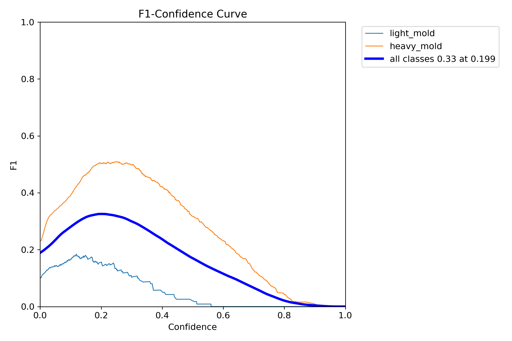 | 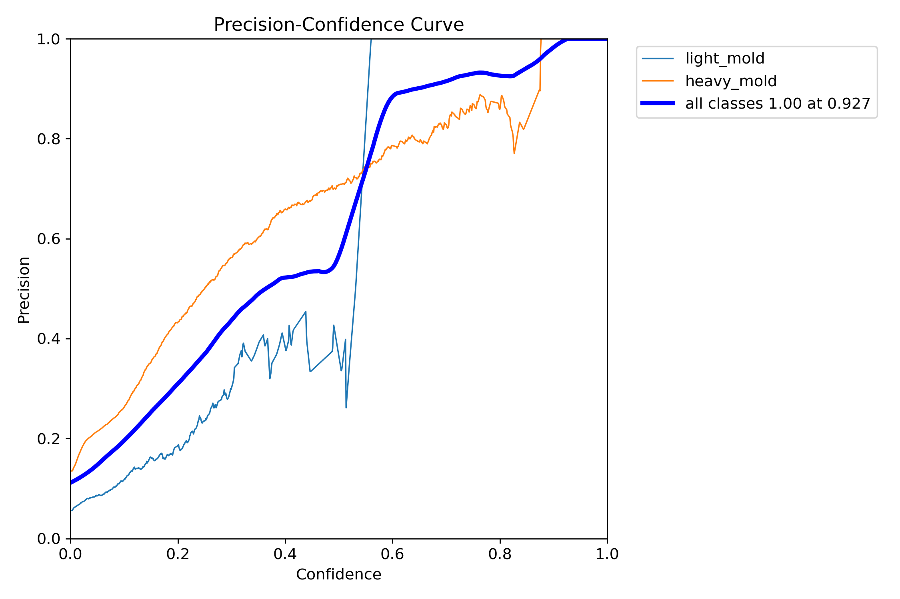 | 
| 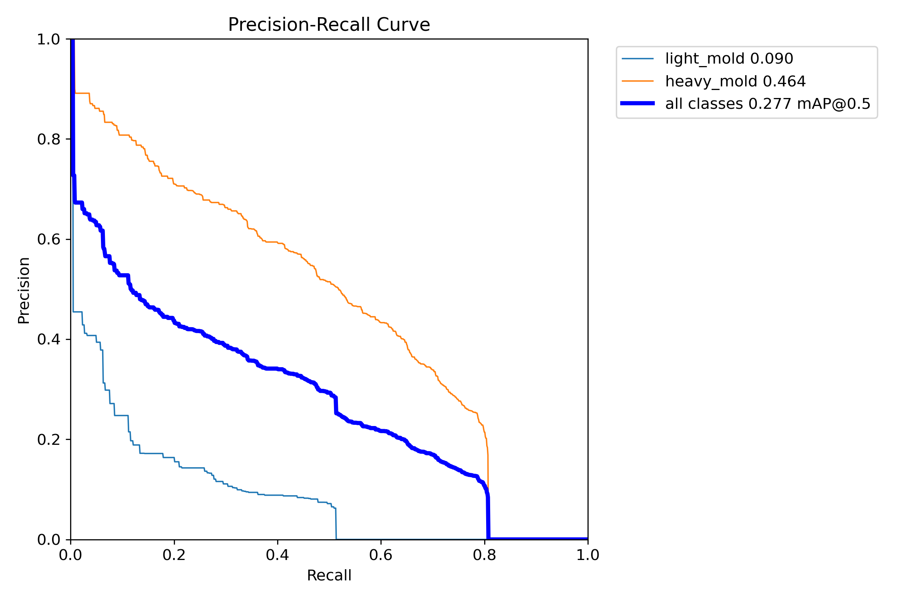 | 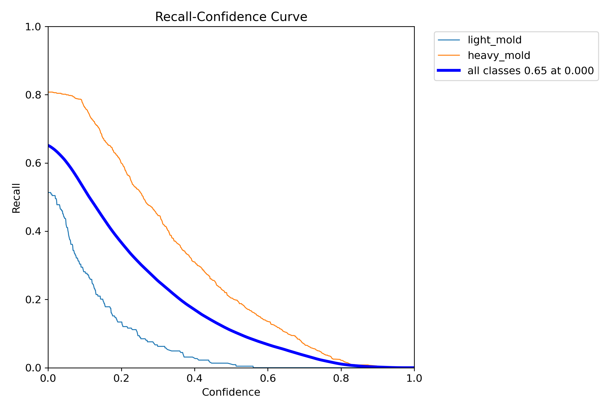 |
| 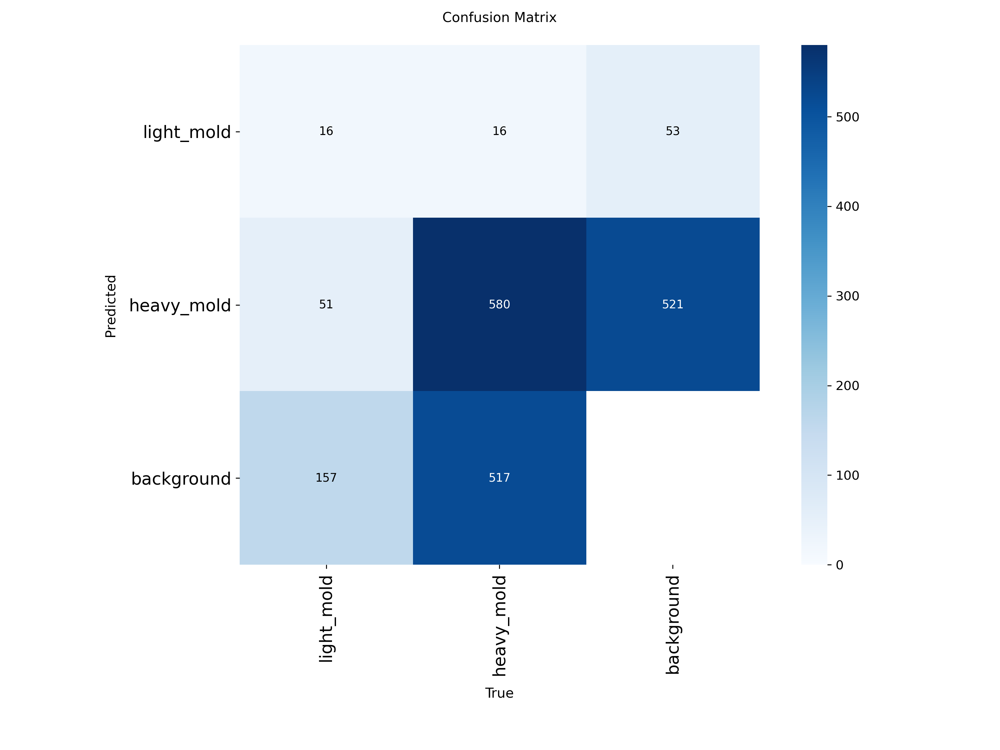 |  |
| 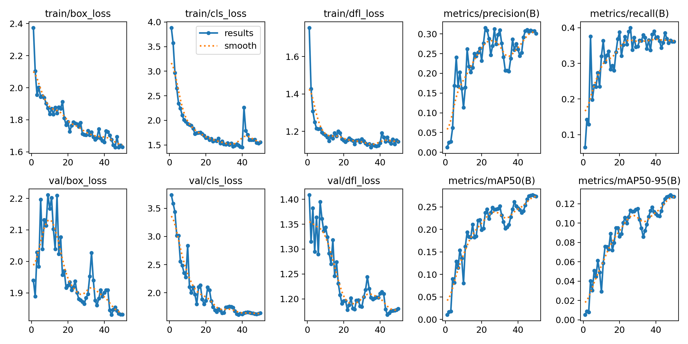|

### v4：YOLOv8n 优化 — 修复数据泄露 + 加入背景图

**实验配置**：
- 模型：YOLOv8n
- 类别：2 类（轻度霉变、重度霉变）
- 数据集：与 v3 相同，但修复了数据泄露问题并加入纯背景图
- 训练轮数：90 epoch
- 图像尺寸：640×640

**上一版的踩坑**：

1. **数据泄露**：v3 中采用了「先增强后划分」的策略，导致同一张原始图片的多个增强版本被分散到训练集和验证集中。验证集中出现了训练集的"双胞胎"图片，使得验证指标虚高，无法真实反映模型的泛化能力。
   - 修复：改为「先划分后增强」，确保验证集与训练集在图片层面完全隔离。

2. **背景噪声**：v3 中模型将水泥地面的黑点、玉米粒之间的阴影误判为霉变，虚警率高。原因是训练集中缺乏纯背景的负样本，模型无法建立清晰的"背景"概念。
   - 修复：在训练集中加入 50 张纯背景图片（空纸盒、空桌面），标注为空（无目标），帮助模型学会区分背景与目标。

**实验过程**：

1. 数据划分修正：将原始图片按 8:1:1 比例随机划分为训练集、验证集、测试集，然后再对各集合分别进行数据增强（旋转 ±15°、水平翻转、亮度调整 ±20%）
2. 负样本注入：在训练集中加入 50 张空背景图片，标注文件为空，让模型学习"什么是背景"
3. 训练时长：从 v3 的 15 epoch 延长至 90 epoch，确保模型充分收敛

**实验结果**：

| 指标 | v3 | v4 | 变化 |
|:---|:---:|:---:|:---:|
| 整体 mAP50 | 0.277 | **0.293** | ↑ +0.016 |
| light_mold AP50 | 0.090 | **0.128** | ↑ +0.038 |
| heavy_mold AP50 | 0.464 | **0.458** | ↓ -0.006 |
| F1 Score | 0.33 | **0.34** | ↑ +0.01 |
| 最佳置信度阈值 | 0.199 | **0.214** | ↑ +0.015 |

**混淆矩阵（v4，Conf_Thresh=0.5）**：

| 真实\预测 | light_mold | heavy_mold | background | 召回率 |
|:---|:---:|:---:|:---:|:---:|
| **light_mold** | 29 | 9 | 8 | **63.0%** |
| **heavy_mold** | 16 | 41 | 65 | **33.6%** |
| **background** | 13 | 44 | 63 | — |

> 注：混淆矩阵为验证集评估结果，样本量较小（轻 46 张、重 122 张），背景 120 张，数值以相对趋势分析为主，绝对值参考意义有限。最终测试集 mAP50 为 0.293。

**PR 曲线分析**：

| 类别 | AP50 | 变化 | 分析 |
|:---|:---:|:---:|:---|
| light_mold | **0.128** | ↑ 0.038 | 轻度霉变提升显著（+42%），说明数据泄露修复和负样本注入对难分类样本帮助最大 |
| heavy_mold | 0.458 | ↓ 0.006 | 重度霉变基本持平，略有下降但波动可忽略 |
| all classes | **0.293** | ↑ 0.016 | 整体小幅提升，主要得益于 light_mold 的改善 |

**关键曲线分析**：

| 曲线 | 关键发现 |
|:---|:---|
| **F1-Confidence** | F1 从 0.33 提升至 0.34，最佳置信度阈值从 0.199 提升至 0.214，说明模型置信度有所改善 |
| **Precision-Confidence** | 最高精确率 1.00 @ 0.988，与 v3 一致，高置信度预测依然高度可靠 |
| **Recall-Confidence** | 最高召回率 0.65 @ 0.000，与 v3 持平，模型对目标的基本覆盖能力未受影响 |
| **训练曲线** | 90 epoch 内各损失函数持续下降，mAP50 从第 40 epoch 起稳定在 0.25-0.30 区间，说明模型已充分收敛 |

**问题分析**：

1. **数据泄露修复效果有限**：v4 的 mAP50 仅从 0.277 提升至 0.293，说明 v3 的虚高程度可能被低估。但 light_mold AP50 从 0.090 跃升至 0.128（+42%），验证了数据泄露修复确实让验证结果更接近真实水平，尤其是对难分类的轻度霉变样本。

2. **背景图注入提升了背景识别能力**：背景列的对角线值从 v3 的 170 降至 v4 的 63（验证集样本量不同，无法直接对比绝对值），但归一化矩阵显示背景→light 从 0.70 降至 0.60，背景→heavy 从 0.46 降至 0.42，说明背景误判有所减少。

3. **轻度霉变仍是最大短板**：虽然 light_mold AP50 提升 42%，但 0.128 的绝对值仍然很低。轻度霉变与背景的视觉差异小，且样本量相对较少，模型难以充分学习其有效特征。

4. **重度霉变召回率偏低**：验证集上 heavy_mold 召回率仅 33.6%，远低于 v3 的 53.6%。考虑到 v4 验证集与 v3 不同（修正了划分方式），且样本量小，这一差异可能来自验证集抽样偏差，而非模型实际性能下降。

| v4训练 | 指标 |
|:---|:---|
| 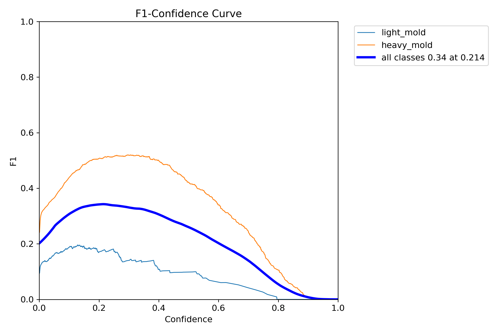 | 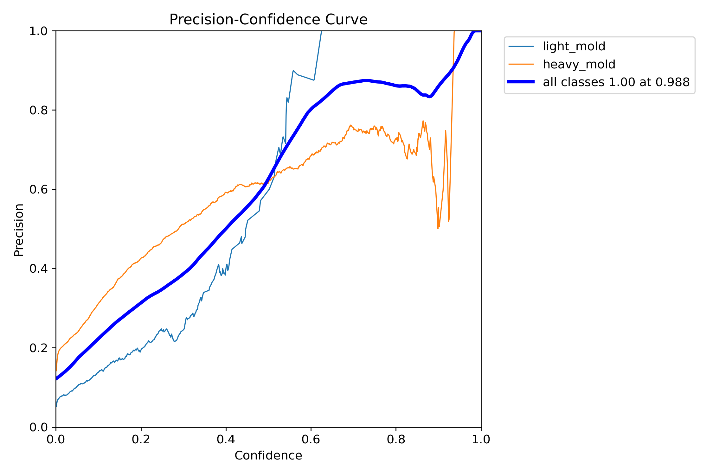 | 
| 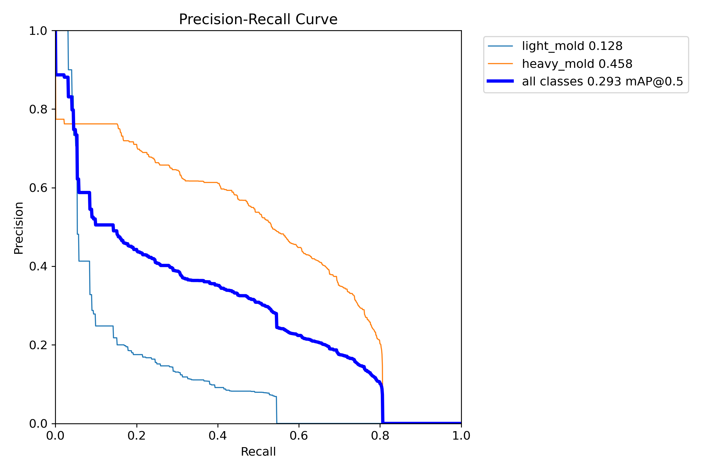 | 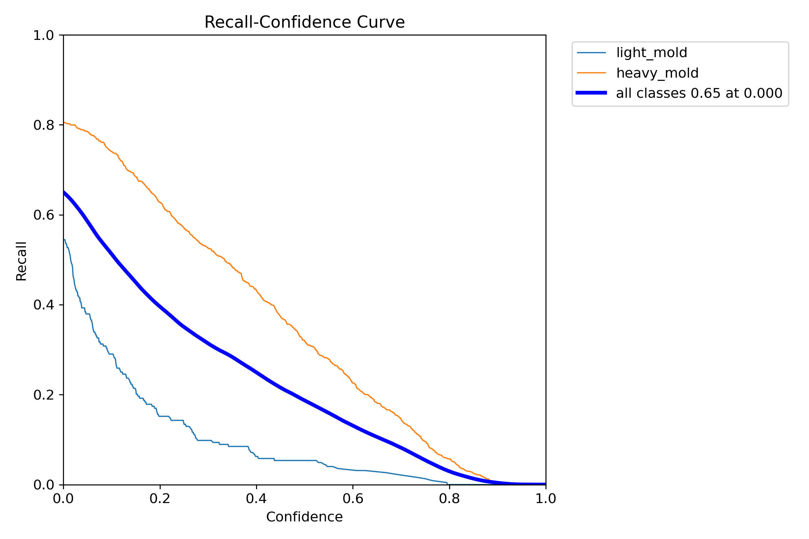 |
| 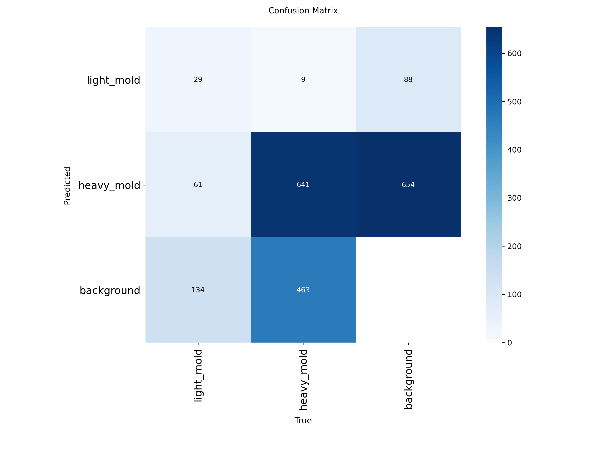 | 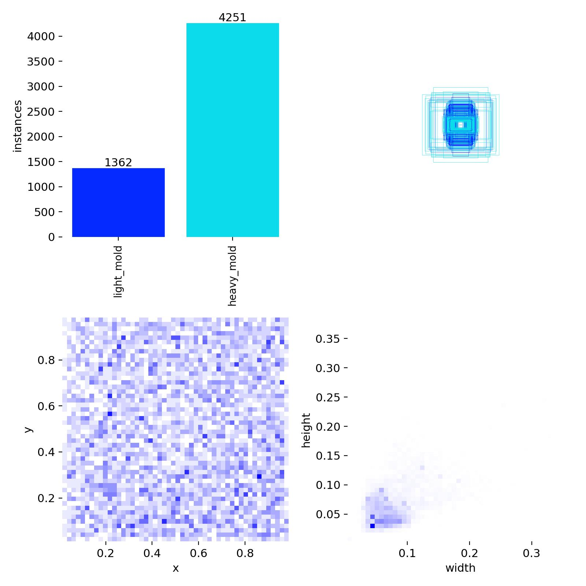 |
| 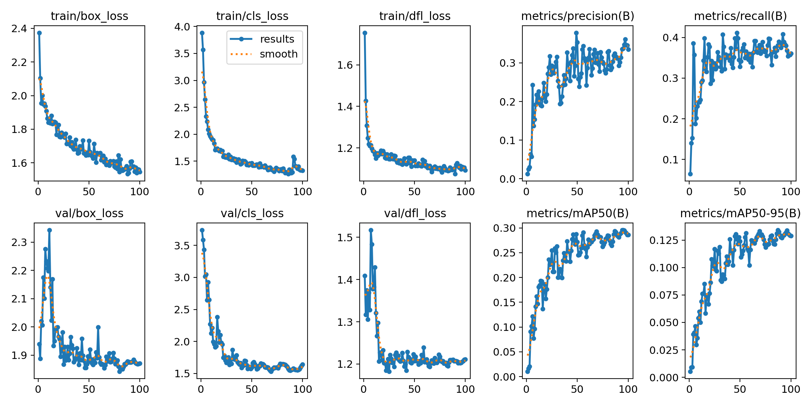|

**核心教训**：

1. **数据划分顺序是关键基础操作**：先划分后增强看似基础，但一旦搞反，轻则 mAP 虚高误导判断，重则让整个实验失去参考价值。这是所有实验的基本功，必须标准化。

2. **负样本注入是降低虚警的有效手段**：加入空背景图片让模型建立了基本的背景概念，减少了背景误判为霉变的比例。后续版本可进一步丰富负样本的多样性（不同光照、不同材质背景）。

3. **YOLOv8n 在小数据集上已接近上限**：在 50 epoch 和 90 epoch 条件下，mAP50 仅从 0.277 提升到 0.293，说明在训练数据量有限的情况下，单纯增加训练轮数的边际收益已经很低。**下一阶段的核心瓶颈已从模型优化转向数据质量提升**。

4. **验证集的代表性至关重要**：v3 和 v4 的对比表明，不同划分方式会导致验证集结果出现较大差异。后续实验应固定随机种子，确保不同版本之间的可比性。

## 阶段三：固定采集标准 + 二分类（v5–v6）★ 最终方案

### 系统瓶颈分析

逐一拆解整个流程后发现：**训练照片采集和工作人员拍照是最容易传入低质量图片的环节**。对于玉米粒这种密集小物体，拍照距离和角度至关重要。

**核心洞察**：不是模型不够好，是输入质量不可控。必须统一拍照标准。

### v5：硬件方案 — 统一采集标准

**硬件设计**：
- 30×40cm 木盒（标准容器）
- 四角立起铁支架，对角线交点投影在正方形中心
- 交点处焊接手机夹，固定 iPhone 14 Pro
- **所有样本照片完全统一距离和角度**

**数据采集流程**：
1. 每次称一斤玉米粒
2. 倒入纸盒中均匀摊开，保证只有薄薄一层，无重叠
3. 随机放入不同数量的轻度发霉和重度发霉玉米粒
4. 手机固定在夹子上拍照

| 固定拍摄相机 | 统一拍照的距离和角度 |
|:---:|:---:|
|  |  |

**二分类策略**：去掉健康类别，只检测 light_mold 和 heavy_mold

**实验结果**：mAP50 = 0.902

### v6：最终上线版 — 数据增强 + 空背景负样本 + 量化部署

**关键改进**：
1. **数据增强**：30 张原图通过旋转、翻转、亮度调整扩至 300 张
2. **空背景负样本**：加入空盒子照片，模型学会"什么是背景"
3. **INT8 量化**：模型从 12MB 压缩到 3.8MB
4. **CoreML 部署**：导出 .mlpackage 集成到 iOS App

**训练成果各项指标**：

| v6训练 | 指标 |
|:---|:---|
|  |  | 
|  | 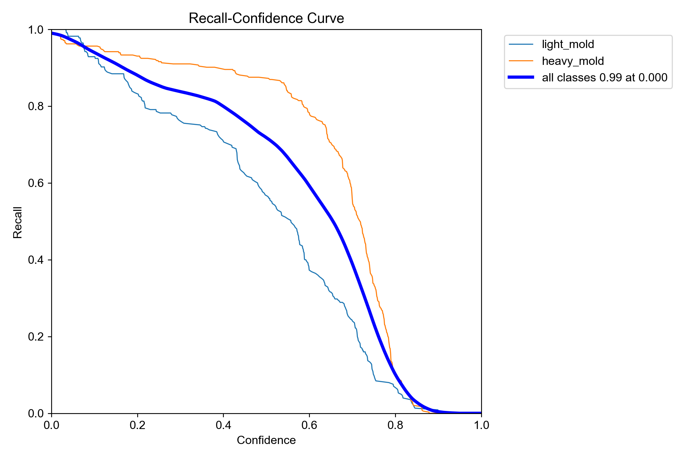 |
|  |  |

**最终效果**：

| 指标 | v1 (Faster RCNN) | v6 (YOLOv8 最终) |
|:---|:---|:---|
| mAP50 | ~0.242 | **0.934** |
| heavy_mold AP50 | — | **0.978** |
| light_mold AP50 | — | 0.891 |
| mAP50-95 | — | 0.653 |
| F1 Score | — | 0.89 |
| 模型大小 | 350MB | **3.8MB** |
| 推理速度 | 5 FPS | **22 FPS** |

 

**混淆矩阵**：

| 真实\预测 | light_mold | heavy_mold | background |
|:---|:---|:---|:---|
| light_mold | 418 (91%) | 1 (0.2%) | 20 (0.4%) |
| heavy_mold | 4 (9%) | 604 (87%) | 8 (0.8%) |

- 背景误判率仅 0.4%–0.8%
- 训练/验证损失高度重合 → 无过拟合

## iOS App 功能

**技术栈**：SwiftUI + AVFoundation + Vision

**核心功能**：
- 实时视频流检测（22 FPS）
- 检测框可视化（轻度→橙色，重度→红色）
- 霉变率自动计算并显示
- 拍照留底，记录 GPS 和时间

**收购流程**：
1. 收购员从 1000 斤玉米中随机抽 20 斤
2. 每斤倒入簸箕摊平，手机固定拍照
3. App 自动预测并记录霉变率
4. 霉变率不高于 5% 正常收购，超标则扣价或拒收

**霉变率计算方案**：
1. **预统计**：称 2 两玉米粒 → 数清粒数 → 重复 20 次 → 正态分布取均值 μ → 一斤玉米粒 ≈ 5μ 粒
2. **预测时**：统计轻度霉变预测框中心点个数 x1、重度霉变 x2
3. **霉变率** = (x1 + x2) / 5μ

**分母固定**、**拍照固定** → 预测质量高度可控。

## 关键教训总结

| 教训 | 来源 |
|:---|:---|
| **健康样本的噪声问题是核心矛盾** | v1, v2 |
| **改 Loss 只是锦上添花，数据质量是根本** | v2 |
| **YOLOv8 是移动端小目标检测的最优解** | v3 |
| **先划分后增强，顺序搞反就是数据泄露** | v4 |
| **训练和预测的输入质量必须高度一致** | v5 |
| **空背景负样本可将背景误判降到 1% 以下** | v6 |
| **硬件标准化采集是落地关键** | v5 |
| **INT8 量化几乎无损压缩，是端侧部署标配** | v6 |

## 技术栈总览

| 环节 | 技术选型 |
|:---|:---|
| 模型训练 | PyTorch, Ultralytics YOLOv8, Faster RCNN |
| 模型转换 | ONNX, CoreML |
| 模型量化 | INT8 量化 |
| 移动端框架 | SwiftUI, AVFoundation, Vision |
| 数据处理 | Label Studio, OpenCV, Albumentations |
| 硬件方案 | 30×40cm 木盒 + 定制手机支架 |

## 📅 项目时间线

| 时间 | 里程碑 |
|:---|:---|
| 2026.04 初 | 立项，需求调研 |
| 2026.04 中 | v1–v2 Faster RCNN 实验，发现健康样本噪声 |
| 2026.04 下 | v3–v4 YOLOv8 轻量化，修复数据泄露 |
| 2026.05 初 | v5 硬件方案 + 二分类 |
| 2026.05 中 | v6 数据增强 + 空背景 + 量化部署，App 开发完成 |
| 2026.06 | 项目整理，GitHub 开源 |

*最后更新：2026.07*