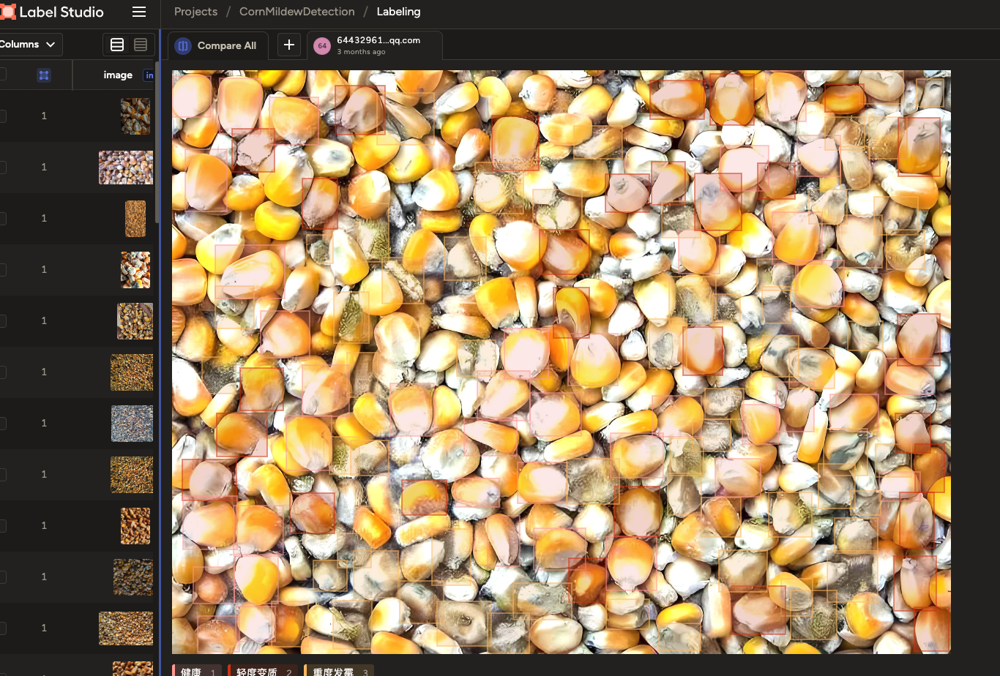
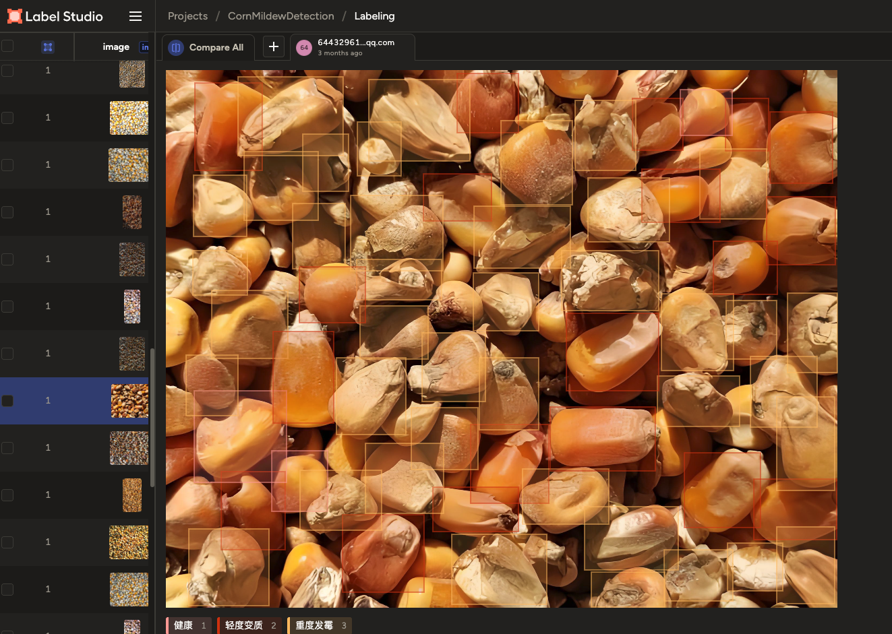
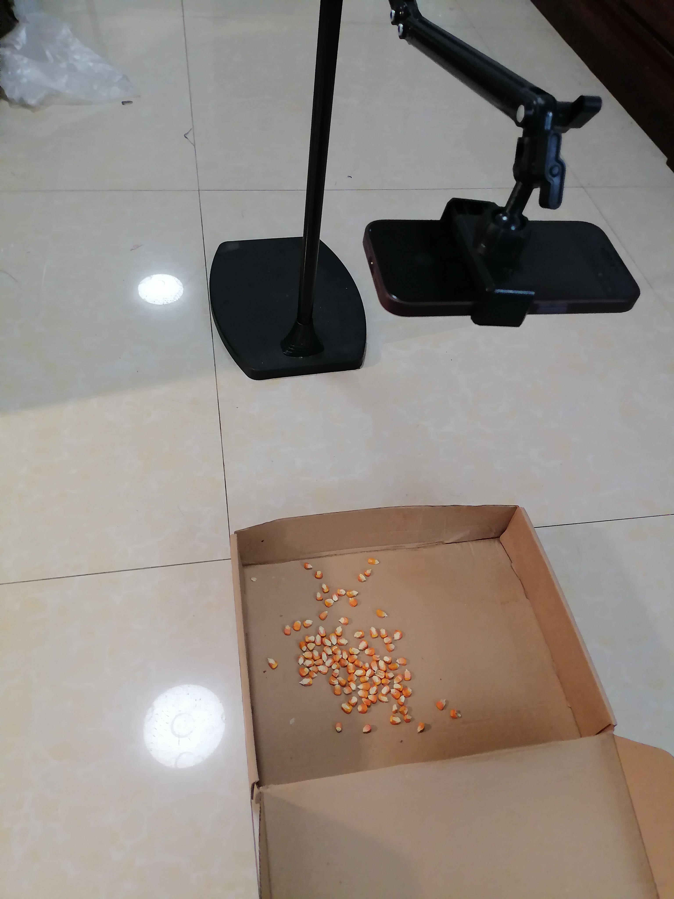
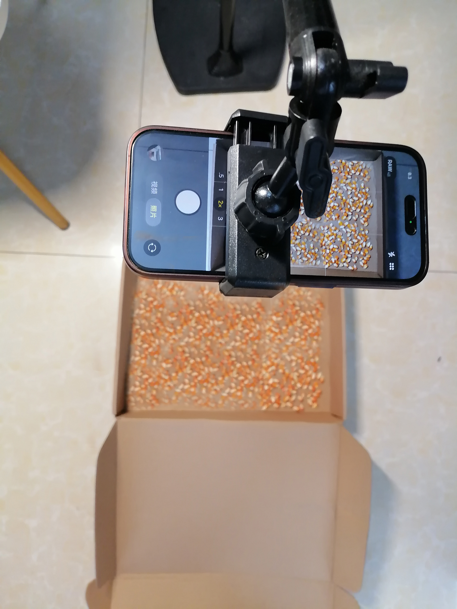
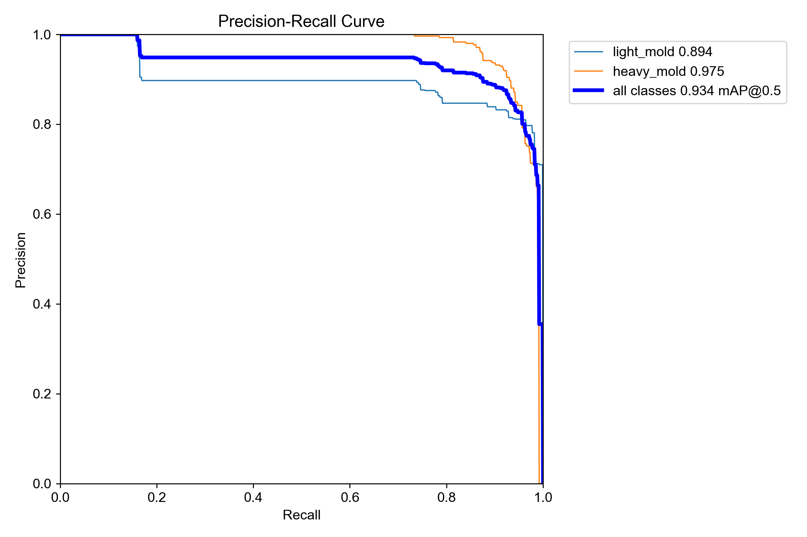
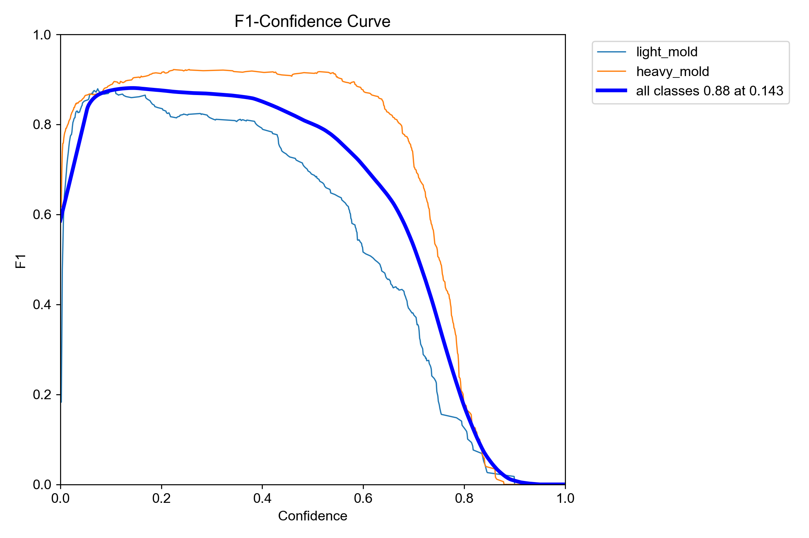
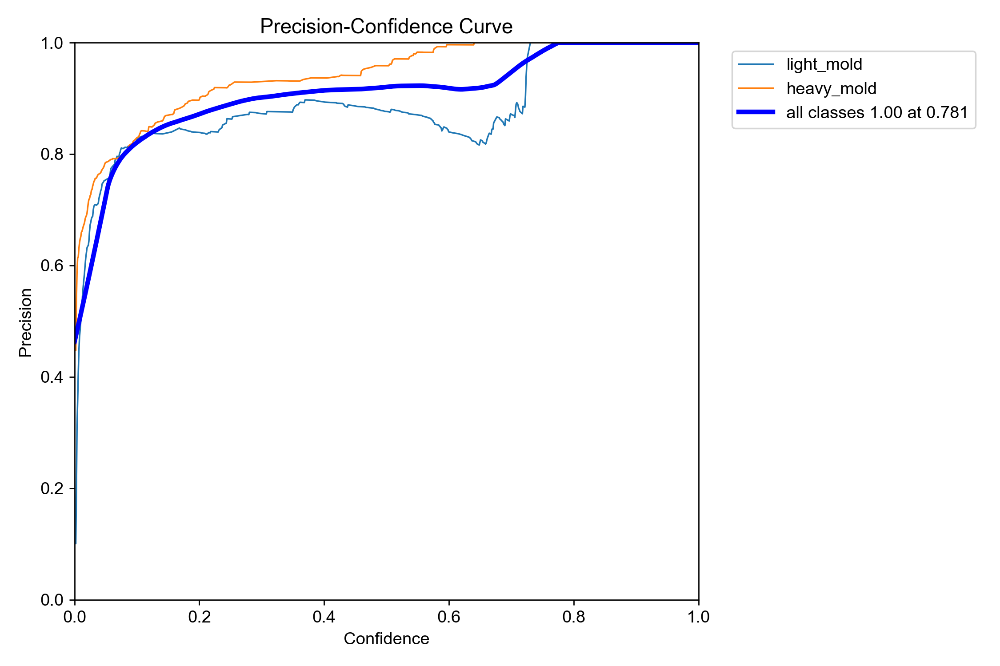
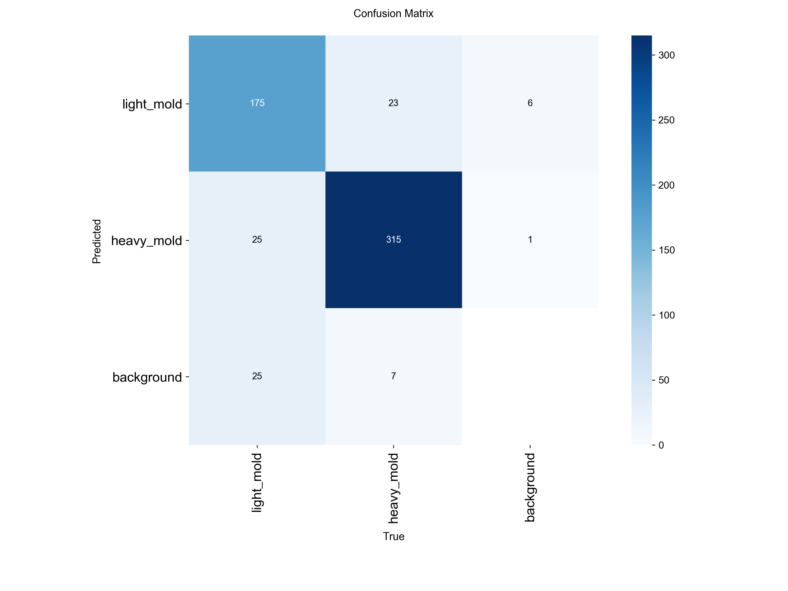
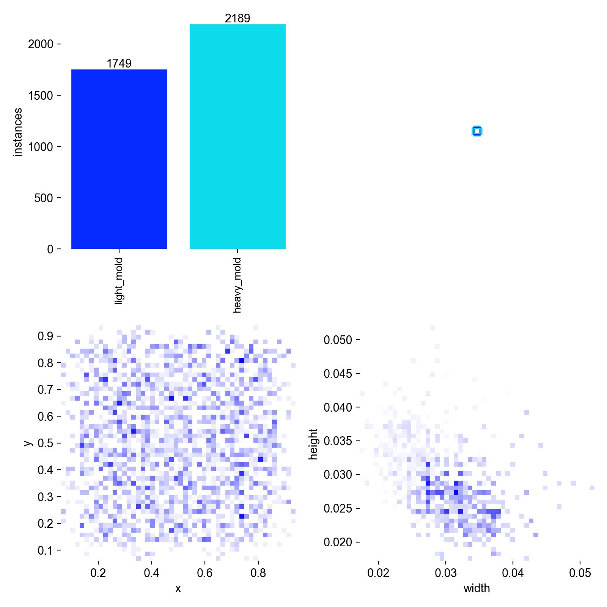

# 🌽 玉米霉变检测 — 项目版本演进全记录

> 从 Faster RCNN 到 YOLOv8，6 版本迭代的真实踩坑与优化之路

## 项目背景

- 此项目为本人从数据采集、模型训练、项目发布全程一人负责完成，项目始于2024年8月初完结与2024年10月，本仓库为复现版本。
- 项目需求很简单：
  * 视觉模型能区分出健康和发霉的玉米粒；
  * 收购玉米粒时，每次定量抽检，模型能算出发霉玉米粒和整体玉米粒的占比，从而决定收购的价格。

**行业痛点**：yx饲料厂在收购玉米原料时，需要判断玉米籽粒的霉变率来决定收购价格和是否收购。传统方式是收购员肉眼观察、牙咬判断，效率低、主观性强、无可追溯记录。

**项目目标**：用深度学习自动检测玉米籽粒霉变，实现从拍照到出霉变率的全自动化，为饲料原料品控提供客观、可追溯的 AI 解决方案。

**核心约束**：
- 需要在普通手机上实时推理（iOS / 鸿蒙）
- 模型大小需控制在 5MB 以内
- 收购现场网络不稳定，必须离线运行

## 最终方案速览

| 版本 | 模型 | 类别数 | mAP50 | 核心改进 |
|:---|:---|:---|:---|:---|
| v1 | Faster RCNN | 3 | ~0.242 | 基线，发现健康样本噪声 |
| v2 | Faster RCNN + Focal Loss | 3 | ~0.263 | Focal Loss 微调，治标不治本 |
| v3 | YOLOv8n | 3 | 0.263 | 轻量化，速度大幅提升 |
| v4 | YOLOv8n 优化 | 3 | 0.273 | 修复数据泄露，加背景图 |
| v5 | YOLOv8 + 固定相机 | 2 | 0.902 | 硬件标准化采集 |
| **v6** | **YOLOv8 + 量化部署** | **2** | **0.934** | **数据增强 + 空背景负样本，最终上线版** |

## 阶段一：Faster RCNN 探索期（v1–v2）

### v1：Faster RCNN baseline — 健康样本成了最大噪声

- 本着先“广泛试错”，再“精确迭代”的推进思路，v1的基线模型用的是FasterRCNN跑的。

**实验过程**：
- 1、训练数据的收集：由于收购玉米的同事并没有系统的收集和拍摄过发霉的玉米粒，最初的训练集照片都是在网上收集的。
- 2、训练集的标注：使用Label Studio，将轻度霉变、重度霉变的玉米粒全部标注出来，健康的玉米粒则标注过半数，剩下健康样本的交给模型去预测（如下图所示）

| 标注 | 示意 |
|:---|:---|
|  |  | 

- 3、霉变率的计算思路：模型识别出所有的玉米粒并统计数量，用霉变的玉米粒数量➗总数量。

**实验配置**：
- 模型：Faster RCNN + ResNet50-FPN
- 类别：3 类（健康、轻度霉变、重度霉变）
- 数据集：210 张（健康 60 张，霉变 150 张），数据增强后约 800 张

**实验结果**：
- 轻度霉变召回率：**仅 6.6%**（漏检率 93.4%）
- 健康样本召回率：62.4%，但 33.6% 被误判为背景
- 重度霉变召回率：55.9%，误检率最低
- 整体 mAP50：~0.242

**问题分析**：
- 轻度霉变与健康玉米外观高度相似，模型几乎无法区分
- 健康样本多样性高，模型倾向于将其归为背景，而非误判为霉变
- 轻度霉变样本内部差异大（霉变面积 5%~40%），模型难以统一建模

- 训练指标如下图所示

| v1实验 | 指标图 |
|:---|:---|
|  |  |

**核心教训**：在 3 类目标检测中，轻度霉变是最薄弱环节。健康样本的多样性导致模型无法有效学习"何为健康"，反而让轻度霉变在特征空间中与健康/背景高度重叠。改 Loss 函数只是锦上添花，数据质量才是根本。

### v2：引入 Focal Loss — 治标不治本

**改进点**：Confidence Threshold 降至 0.3，改用 Focal Loss

**实验结果**：mAP50 从 0.242 微涨到 0.263，漏检率仍高达 82%

**核心教训**：改 Loss 只是锦上添花，数据质量才是根本。

## 阶段二：YOLOv8 轻量化转折（v3–v4）

### v3：YOLOv8n 基线

**改进**：用 YOLOv8n 替代 Faster RCNN，模型从 350MB 压缩到 12MB，推理速度从 5FPS 提升到 18FPS

**实验结果**：mAP50 = 0.263，精度速度双达标，但拍照差异导致精度波动

### v4：YOLOv8n 优化 — 修复数据泄露 + 加背景图

**踩坑**：
1. **数据泄露**：先增强后划分 → 验证集有训练集的"双胞胎" → mAP 虚高
2. **背景噪声**：水泥地裂缝、蛇皮袋图案被误判为霉变

**修复**：严格先划分后增强 + 加入纯背景图

**实验结果**：mAP50 = 0.273，light_mold = 0.121，heavy_mold = 0.426

## 阶段三：固定采集标准 + 二分类（v5–v6）★ 最终方案

### 系统瓶颈分析

逐一拆解整个流程后发现：**训练照片采集和工作人员拍照是最容易传入低质量图片的环节**。对于玉米粒这种密集小物体，拍照距离和角度至关重要。

**核心洞察**：不是模型不够好，是输入质量不可控。必须统一拍照标准。

### v5：硬件方案 — 统一采集标准

**硬件设计**：
- 30×40cm 木盒（标准容器）
- 四角立起铁支架，对角线交点投影在正方形中心
- 交点处焊接手机夹，固定 iPhone 14 Pro
- **所有样本照片完全统一距离和角度**

**数据采集流程**：
1. 每次称一斤玉米粒
2. 倒入纸盒中均匀摊开，保证只有薄薄一层，无重叠
3. 随机放入不同数量的轻度发霉和重度发霉玉米粒
4. 手机固定在夹子上拍照

| 固定拍摄相机 | 统一拍照的距离和角度 |
|:---:|:---:|
|  |  |

**二分类策略**：去掉健康类别，只检测 light_mold 和 heavy_mold

**实验结果**：mAP50 = 0.902

### v6：最终上线版 — 数据增强 + 空背景负样本 + 量化部署

**关键改进**：
1. **数据增强**：30 张原图通过旋转、翻转、亮度调整扩至 300 张
2. **空背景负样本**：加入空盒子照片，模型学会"什么是背景"
3. **INT8 量化**：模型从 12MB 压缩到 3.8MB
4. **CoreML 部署**：导出 .mlpackage 集成到 iOS App

**训练成果各项指标**：

| 训练 | 指标 |
|:---|:---|
|  |  | 
|  |  |
|  |  |

**最终效果**：

| 指标 | v1 (Faster RCNN) | v6 (YOLOv8 最终) |
|:---|:---|:---|
| mAP50 | ~0.242 | **0.934** |
| heavy_mold AP50 | — | **0.978** |
| light_mold AP50 | — | 0.891 |
| mAP50-95 | — | 0.653 |
| F1 Score | — | 0.89 |
| 模型大小 | 350MB | **3.8MB** |
| 推理速度 | 5 FPS | **22 FPS** |

 

**混淆矩阵**：

| 真实\预测 | light_mold | heavy_mold | background |
|:---|:---|:---|:---|
| light_mold | 418 (91%) | 1 (0.2%) | 20 (0.4%) |
| heavy_mold | 4 (9%) | 604 (87%) | 8 (0.8%) |

- 背景误判率仅 0.4%–0.8%
- 训练/验证损失高度重合 → 无过拟合

## iOS App 功能

**技术栈**：SwiftUI + AVFoundation + Vision

**核心功能**：
- 实时视频流检测（22 FPS）
- 检测框可视化（轻度→橙色，重度→红色）
- 霉变率自动计算并显示
- 拍照留底，记录 GPS 和时间

**收购流程**：
1. 收购员从 1000 斤玉米中随机抽 20 斤
2. 每斤倒入簸箕摊平，手机固定拍照
3. App 自动预测并记录霉变率
4. 霉变率不高于 5% 正常收购，超标则扣价或拒收

**霉变率计算方案**：
1. **预统计**：称 2 两玉米粒 → 数清粒数 → 重复 20 次 → 正态分布取均值 μ → 一斤玉米粒 ≈ 5μ 粒
2. **预测时**：统计轻度霉变预测框中心点个数 x1、重度霉变 x2
3. **霉变率** = (x1 + x2) / 5μ

**分母固定**、**拍照固定** → 预测质量高度可控。

## 关键教训总结

| 教训 | 来源 |
|:---|:---|
| **健康样本的噪声问题是核心矛盾** | v1, v2 |
| **改 Loss 只是锦上添花，数据质量是根本** | v2 |
| **YOLOv8 是移动端小目标检测的最优解** | v3 |
| **先划分后增强，顺序搞反就是数据泄露** | v4 |
| **训练和预测的输入质量必须高度一致** | v5 |
| **空背景负样本可将背景误判降到 1% 以下** | v6 |
| **硬件标准化采集是落地关键** | v5 |
| **INT8 量化几乎无损压缩，是端侧部署标配** | v6 |

## 技术栈总览

| 环节 | 技术选型 |
|:---|:---|
| 模型训练 | PyTorch, Ultralytics YOLOv8, Faster RCNN |
| 模型转换 | ONNX, CoreML |
| 模型量化 | INT8 量化 |
| 移动端框架 | SwiftUI, AVFoundation, Vision |
| 数据处理 | Label Studio, OpenCV, Albumentations |
| 硬件方案 | 30×40cm 木盒 + 定制手机支架 |

## 📅 项目时间线

| 时间 | 里程碑 |
|:---|:---|
| 2026.04 初 | 立项，需求调研 |
| 2026.04 中 | v1–v2 Faster RCNN 实验，发现健康样本噪声 |
| 2026.04 下 | v3–v4 YOLOv8 轻量化，修复数据泄露 |
| 2026.05 初 | v5 硬件方案 + 二分类 |
| 2026.05 中 | v6 数据增强 + 空背景 + 量化部署，App 开发完成 |
| 2026.06 | 项目整理，GitHub 开源 |

*最后更新：2026.07*