# 🌽 玉米霉变检测APP系统 — 项目版本演进全记录

> 从 Faster RCNN 到 YOLOv8，6 版本迭代的真实踩坑与优化之路

| APP界面 | 成果示意 |
|:---|:---|
|  | 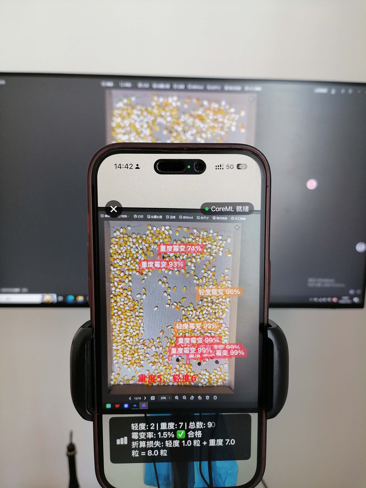 |
| app的界面 | 预测展示（真实：重5轻6，实际折损8粒；预测：重7轻2，预测折损8粒） |
| 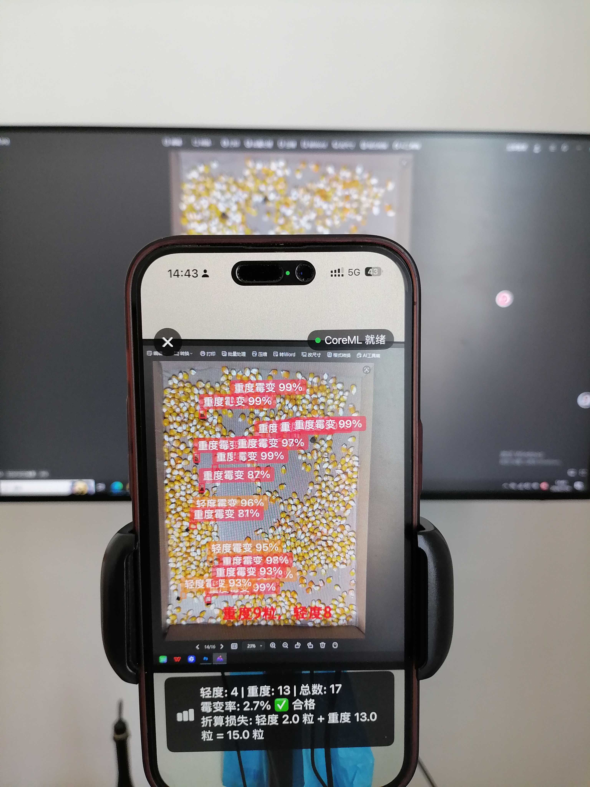 | 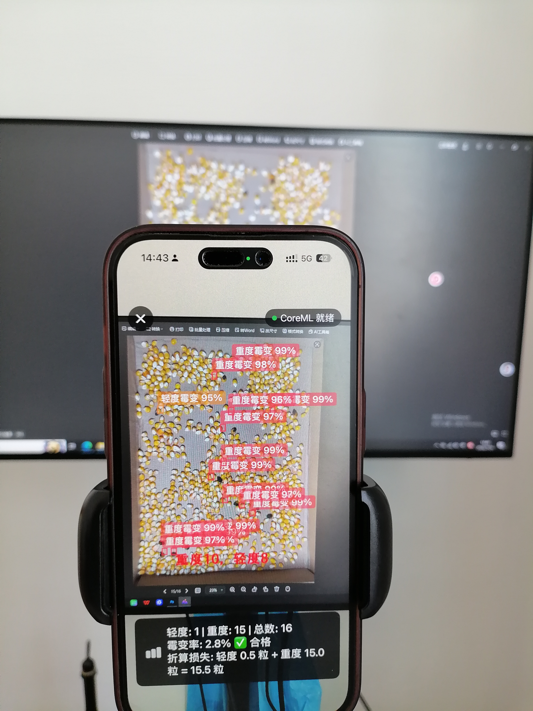 |
| 预测展示（真实：重9轻8，实际折损13粒；预测：重13轻4，预测折损15粒） | 预测展示（真实：重10轻8，实际折损14粒；预测：重15轻1，预测折损15.5粒） |
| 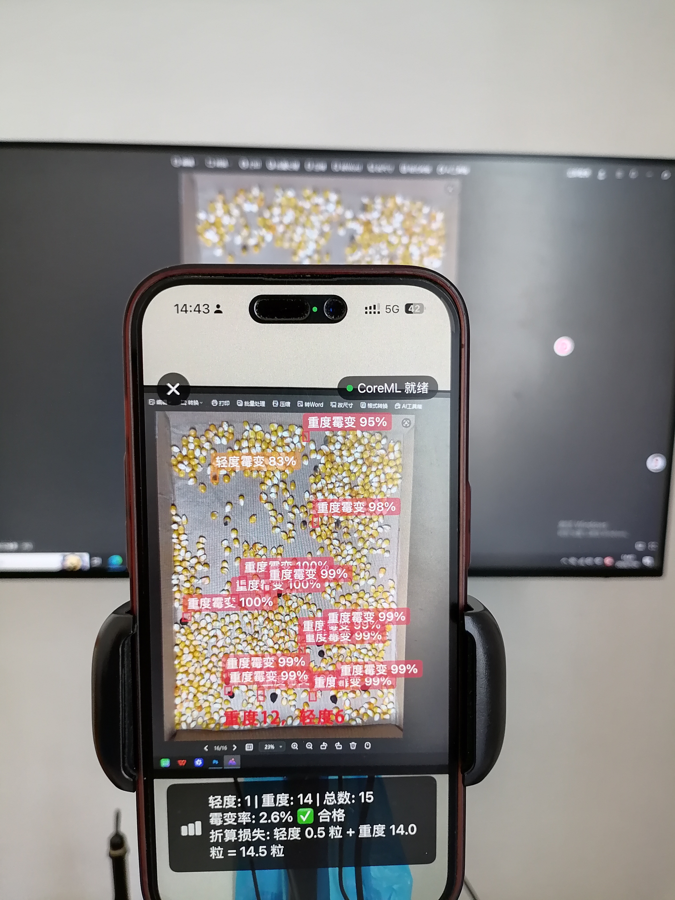 | 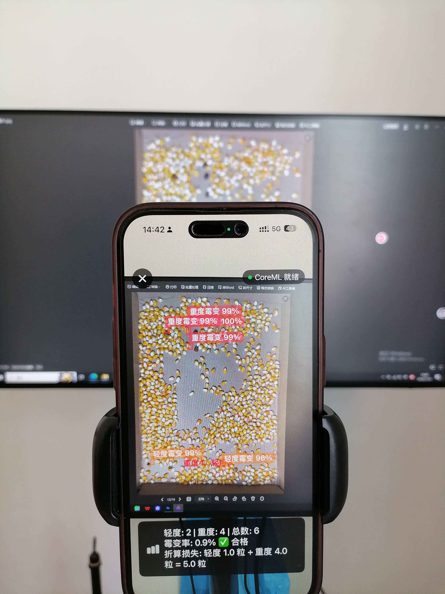 |
| 预测展示（真实：重12轻6，实际折损15粒；预测：重14轻1，预测折损14.5粒） | 预测展示（真实：重4轻2，实际折损5粒；预测：重4轻2，预测折损5粒） |

## 最终方案速览

| 版本 | 模型 | 类别数 | mAP50 | 核心改进 |
|:---|:---|:---|:---|:---|
| v1 | Faster RCNN | 3 | ~0.242 | 基线，发现健康样本噪声 |
| v2 | Faster RCNN + Focal Loss | 3 | ~0.263 | Focal Loss 微调，治标不治本 |
| v3 | YOLOv8n | 2 | 0.263 | 轻量化，速度大幅提升 |
| v4 | YOLOv8n 优化 | 2 | 0.273 | 修复数据泄露，加背景图 |
| v5 | YOLOv8 + 固定相机 | 2 | 0.902 | 硬件标准化采集 |
| **v6** | **YOLOv8 + 量化部署** | **2** | **0.934** | **数据增强 + 空背景负样本，最终上线版** |

## 项目背景

- 此项目为本人从数据采集、模型训练、项目发布全程一人负责完成，项目 2024 年 8 月初启动，2024 年 10 月全部开发、测试完成，**原项目为企业内部项目，涉及业务数据和代码，仓库仅保留可公开的复现版本，完整还原了实验流程、模型训练过程与部署方案。**
- 饲料加工员提的项目需求很简单：
  * 视觉模型能区分出健康和发霉的玉米粒；
  * 收购玉米粒时，每次定量抽检，模型能算出发霉玉米粒和整体玉米粒的占比，从而决定收购的价格。要求轻度发霉不高于**7%**，重度发霉不高于**2%**，整体霉变率不高于**5%**。
  * 发霉程度的定义：玉米粒可分胚芽端和脂肪端两部分，胚芽亲水，脂肪段憎水，霉变始于胚芽。只有 **胚芽端发霉** 的玉米定义为“轻度发霉”，**脂肪端有发霉** 迹象直接定义为“重度发霉”。
  * 加工流程简述：饲料机器会将发霉的玉米粒筛出，丢弃重度发霉玉米粒，并将轻度发霉的玉米粒的胚芽和脂肪剥离，只保留脂肪端。所以一粒轻度发霉的玉米粒损失了一半的重量。**100粒** 的玉米有**7粒轻度发霉**，剥离胚芽只剩一半的重量就是**3.5粒**，整个过程相当于丢弃了2粒重度发霉玉米和3.5粒的轻度发霉玉米，合计等效丢弃霉变籽粒 **5.5粒**，**整体霉变率5%**就是这么来的。

| 发霉玉米示意 | 玉米粒组成示意 |
|:---|:---|
| 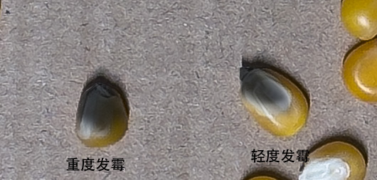 | 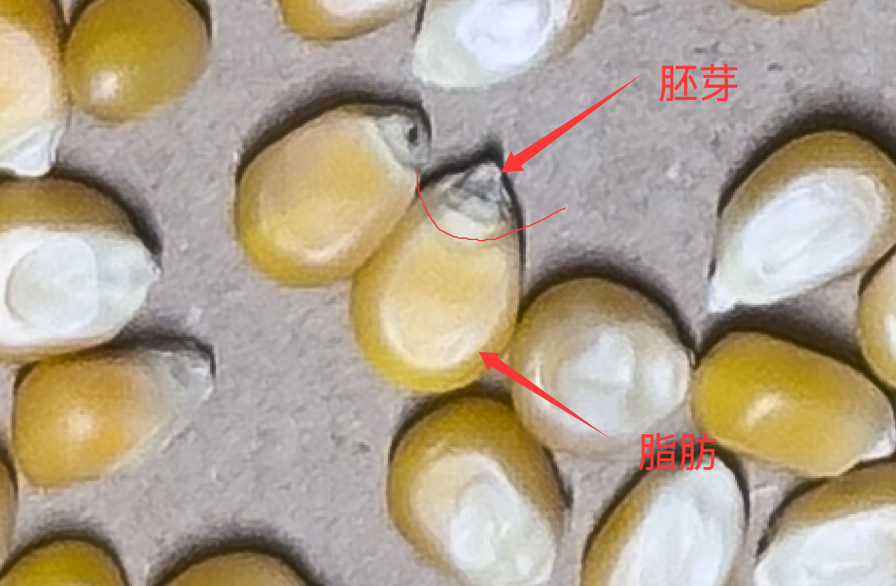 |

**行业痛点**：
yx饲料厂在收购玉米原料时，需要判断玉米籽粒的霉变率来决定收购价格和是否收购。传统方式是收购员肉眼观察、牙咬判断，效率低、主观性强、无可追溯记录。

**项目目标**：用深度学习自动检测玉米籽粒霉变，实现从拍照到出霉变率的全自动化，为饲料原料品控提供客观、可追溯的 AI 解决方案，以达到**降低饲料厂的玉米原料丢弃率**。

**核心约束**：
- 需要在普通手机上实时推理（iOS / 鸿蒙），**本项目以iPhone14Pro作为演示**。
- 模型大小需控制在 5MB 以内
- 收购现场网络不稳定，必须离线运行

## 阶段一：Faster RCNN 探索期（v1–v2）

### v1 FasterRCNN baseline
**实验思路**：
- **数据的收集：**以往的收购员并没有系统的收集和拍摄过发霉的玉米粒，第一批的训练集图片都是在网上收集的。**最初的设想就是的把各种品种、各种霉菌的玉米图片全部收集，让模型学习霉变多样性特征**。

| 部分训练 | 图片示意 |
|:---|:---|
| 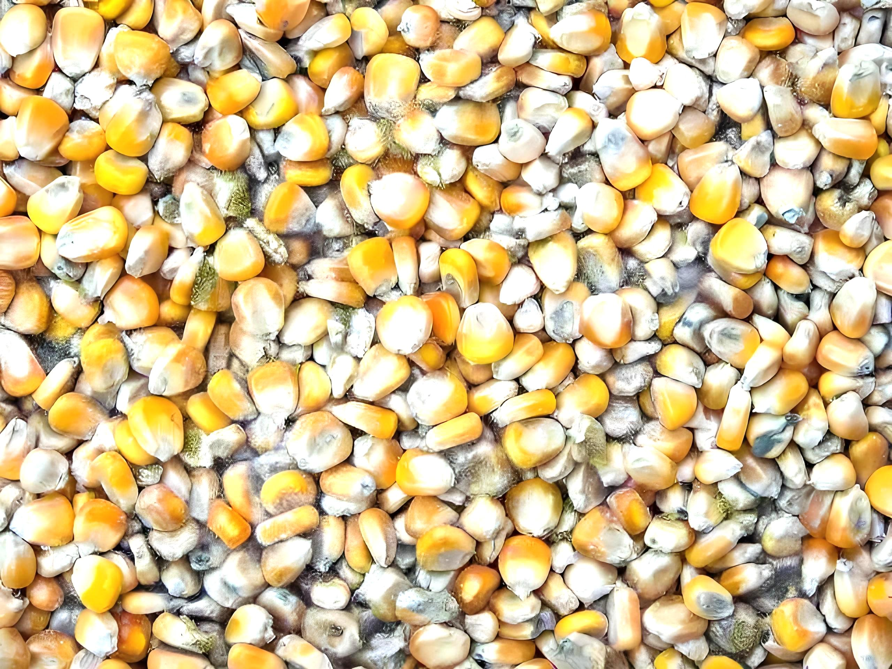 | 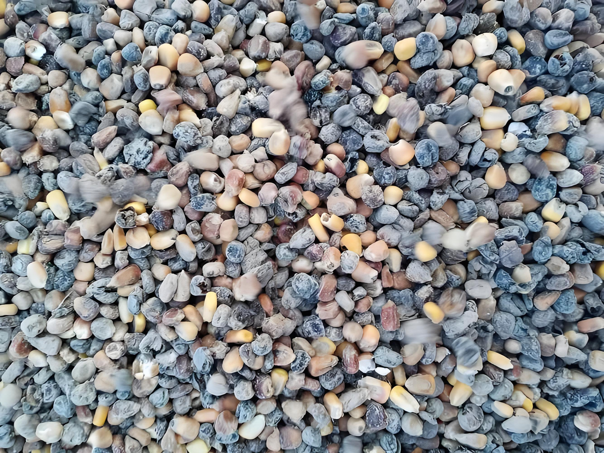 
| 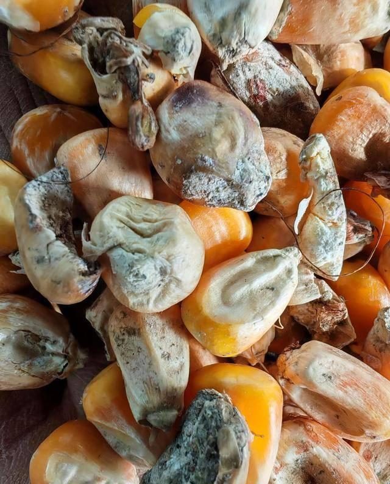 | 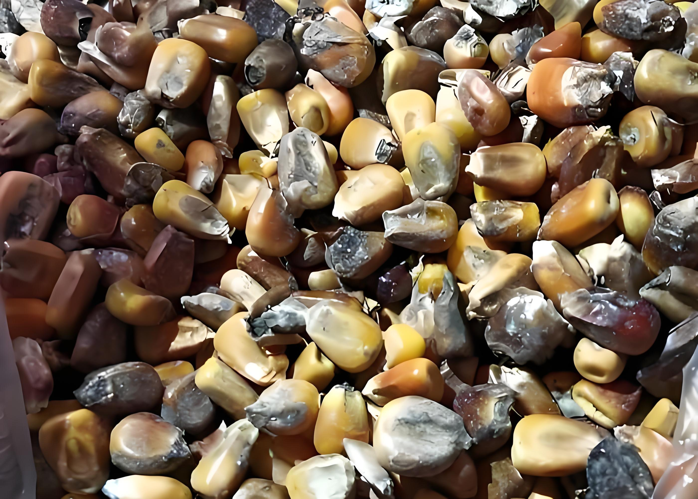 |

- **框架的选择：**由于玉米粒是密集型的小目标，并且堆叠起来会层层遮挡，并不能直接判断哪个框架更合适本项目，直接选用单一检测算法可能存在局限。因此，**本阶段分别采用 Faster R-CNN 与 YOLOv8 算法构建 Baseline，通过对比实验评估各模型在当前复杂场景下的检测性能，从而确定最优的技术路线**。
- **霉变率的计算：**将训练集的玉米粒归纳为健康、轻度霉变和重度霉变三类样本，模型预测阶段的计算逻辑是：
**霉变率 = (轻度霉变数 + 重度霉变数)/(健康数 + 轻度霉变数 + 重度霉变数)。**

- 考虑到健康样本数量庞大且特征单一，为提升标注效率，采取了 **“全量标注霉变样本 + 抽样/半自动标注健康样本”** 的策略。即人工确保所有霉变粒被精准捕捉，健康样本则通过模型辅助预测完成剩余部分的标注（标注示意如下图所示）。

| 标注 | 示意 |
|:---|:---|
| 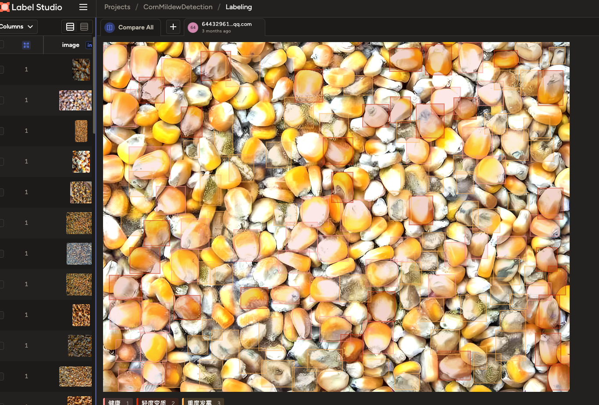 | 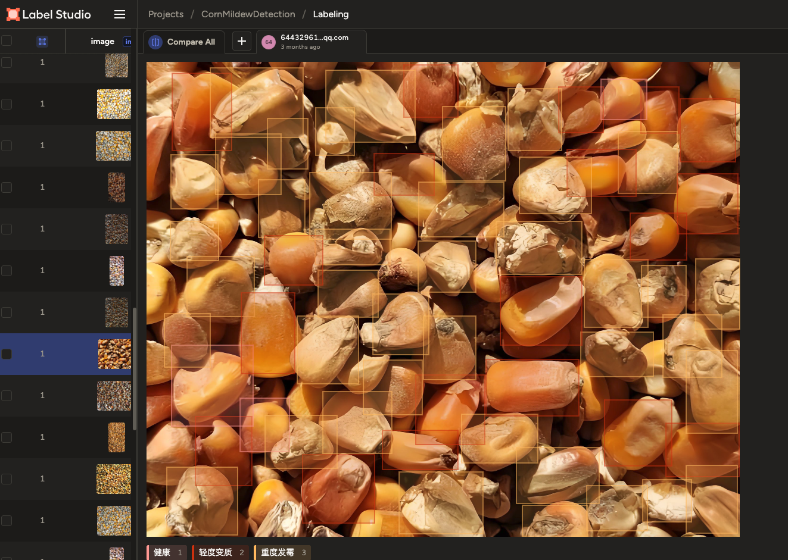 |

**实验配置**：
- 模型：Faster RCNN + ResNet50-FPN
- 类别：3 类（健康、轻度霉变、重度霉变）
- 数据集：210 张（健康 60 张，霉变 150 张），数据增强后约 800 张
- 标注耗时：7天

**实验结果**（Epoch 15，CONF_THRESH=0.5，IOU_MATCH_THRESH=0.45）：

从混淆矩阵可以清晰看到三类样本的真实表现：

| 真实类别 | 被预测为背景 | 被预测为健康 | 被预测为轻度霉变 | 被预测为重度霉变 | 召回率 |
|:---|:---:|:---:|:---:|:---:|:---:|
| **健康** | 119 | **221** | 4 | 10 | **62.4%** |
| **轻度霉变** | 201 | 48 | **24** | 90 | **仅 6.6%** |
| **重度霉变** | 470 | 23 | 12 | **640** | **55.9%** |

- 整体 mAP50：≈ **0.242**
- 轻度霉变几乎「看不见」：363 个真实轻度霉变样本中，只有 24 个被正确检出，漏检率高达 93.4%。其中 **201 个直接被漏检（预测为背景）**，90 个被误判为重度霉变。
- 健康样本召回 62.4%，但有 33.6%（119 个）直接被模型忽略成背景，几乎不会被误判为霉变。
- 重度霉变是三类中表现最好的，但仍有大量（470 个）被漏检为背景。

**mAP 收敛曲线分析**：
mAP 在前 3 个 epoch 快速上升到 0.21 左右，之后进入缓慢爬升阶段，到第 14 个 epoch 仅达到约 0.24，曲线已经明显趋于平坦。说明在当前数据和类别定义下，模型很快就触及了能力上限，继续训练收益极低。

| v1实验 | 指标图 |
|:---|:---|
| 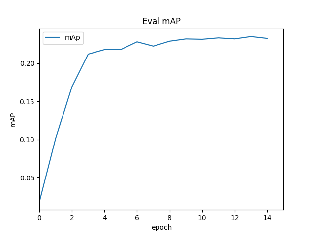 | 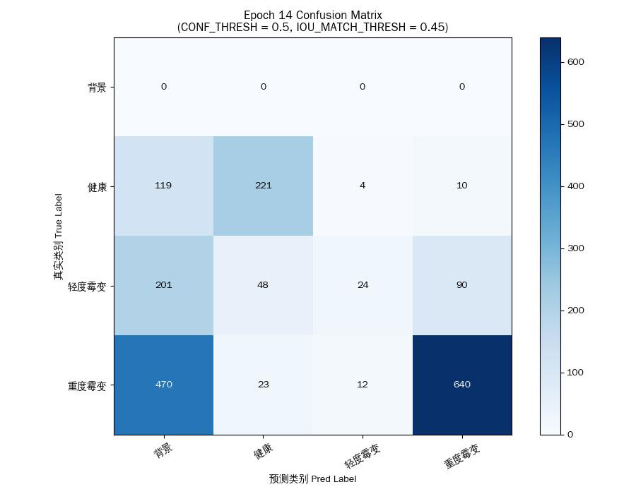 |

**问题分析**：

1. **轻度霉变成为彻底的「盲区」**  
   召回率仅 6.6%。混淆矩阵显示，大量轻度霉变被直接漏检（201 个预测为背景）或误判为重度霉变（90 个）。  
   根本原因在于：**健康玉米粒只标注了过半数**，图片中大量真实存在的健康区域在训练时被当作负样本（背景）。轻度霉变与健康外观高度相似，模型因此学到了一个很强的错误先验——「长得像健康的东西，大概率是背景，不用检测」。结果真正的轻度霉变也被一起漏掉了。

2. **健康样本成了最大的噪声源**  
   健康玉米粒标注不完整。模型宁可把它判成背景，也不愿意给出明确的「健康」预测。这进一步把轻度霉变推向了与「健康/背景」高度重叠的模糊区域，决策边界几乎无法建立。

3. **重度霉变相对可靠，但仍大量漏检**  
   虽然 Precision 较高（被误判成轻度和健康的比例很低），但召回只有 55.9%，说明即使是视觉差异最大的类别，在网络图片这种非标准化、标注不完整的数据下，漏检依然严重。

4. **mAP 曲线提前平台化**  
   快速上升后长期停滞在 0.24 附近，进一步印证了「不是训练不充分，而是数据和类别定义本身存在结构性缺陷」——继续堆 epoch 或调参收益极低。

**核心教训**：
- 1. 在三分类目标检测中，轻度霉变是最薄弱、也最关键的环节。健康样本的**不完整标注 + 高多样性**，让模型无法有效学习「什么是健康」，反而把轻度霉变推入了与健康/背景高度重叠的区域。
- 2. v1这个大版本下，其实尝试过几个算法层面优化的小版本（换 backbone、调学习率、加 epoch），但发现几乎没啥效果，真正的瓶颈在于**类别定义不合理 + 正样本边界模糊 + 数据来源不统一**。
- 3. 部分标注策略是隐性噪声源：未标注的健康样本在训练中被模型学习为"背景"，导致健康/轻度霉变/背景三类特征空间重叠，加剧了轻度霉变的误判。这一教训直接推动了 v3 的"去健康类别"决策。

### v2：引入 Focal Loss — 治标不治本

**改进点**：Confidence Threshold 降至 0.3，改用 Focal Loss

**实验配置**：
- 模型：Faster RCNN + ResNet50-FPN
- 损失函数：Cross Entropy Loss → Focal Loss（γ=2, α=0.25）
- 类别：3 类（健康、轻度霉变、重度霉变）
- 置信度阈值：0.3
- 数据集：与 v1 相同

**实验结果**：

| 指标 | v1 | v2 | 变化 |
|:---|:---:|:---:|:---:|
| 整体 mAP50 | ~0.242 | **~0.263** | ↑ +0.021 |
| 健康召回率 | 62.4% | **65.1%** | ↑ +2.7% |
| 轻度霉变召回率 | 6.6% | **36.9%** | ↑ +30.3% |
| 重度霉变召回率 | 55.9% | **65.8%** | ↑ +9.9% |

**混淆矩阵（v2，Conf_Thresh=0.3）**：

| 真实类别 | 背景 | 健康 | 轻度霉变 | 重度霉变 | 召回率 |
|:---|:---:|:---:|:---:|:---:|:---:|
| **健康** | 111 | **233** | 4 | 10 | **65.1%** |
| **轻度霉变** | 101 | 48 | **99** | 20 | **36.9%** |
| **重度霉变** | 353 | 23 | 10 | **744** | **65.8%** |

| v2实验 | 指标图 |
|:---|:---|
| 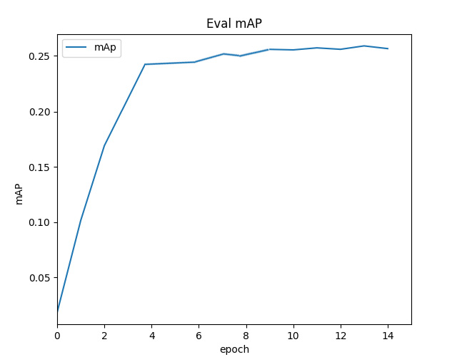 | 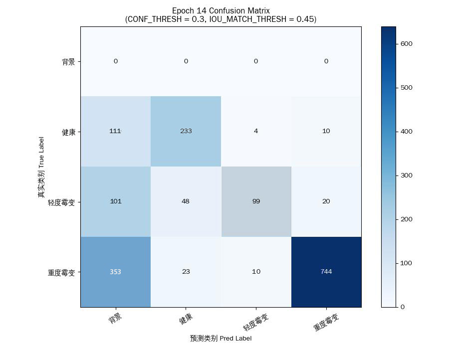 |

**mAP 收敛曲线**：
mAP 从第 8 个 epoch 开始逐步爬升，到第 14 个 epoch 约 0.26，整体呈现上升趋势但增速放缓，表明模型仍有学习空间，但增益已非常有限。

**问题分析**：

1. **轻度霉变改善显著，但仍为短板**：召回率从 6.6% 跃升至 36.9%，提升了 30 个百分点，说明 Focal Loss 确实让模型更加关注难分类的轻度霉变样本。但仍有 63.1% 的轻度霉变样本未被正确识别：
   - 37.7%（101 张）被误判为背景 → 模型仍然"看不见"部分轻度霉变
   - 17.9%（48 张）被误判为健康 → 轻度霉变与健康在特征空间中仍有大面积重叠
   - 仅 7.5%（20 张）被误判为重度霉变 → 至少模型不会把轻度过度放大

2. **重度霉变稳定提升**：召回率从 55.9% 提升到 65.8%，误判为轻度和健康的比例极低（合计不到 3%）。说明 Focal Loss 让模型对重度霉变的识别更充分，且判断准确。

3. **健康样本变化不大**：召回率 65.1%，31.0%（111 张）被误判为背景，模式与 v1 基本一致——模型倾向于忽略健康样本而非误判为霉变，这反而是好事（至少不会把好玉米当成坏玉米）。

4. **mAP 仍然偏低**：0.263 的 mAP50 虽然比 v1 有提升，但离实际应用仍有巨大差距。轻度霉变 36.9% 的召回率意味着每 3 颗轻度霉变玉米粒中就有近 2 颗被漏检。

**核心教训**：

Focal Loss 通过降低易分类样本（背景、健康）的损失权重，让模型更关注难分类样本（轻度霉变、重度霉变），确实带来了全面改善，尤其是对轻度霉变（↑ 30.3%）。但即便如此，轻度霉变召回率也仅为 36.9%——**算法优化只能缓解问题，无法根治问题**。

v2 验证了一个关键结论：**轻度霉变与健康玉米的视觉特征高度重叠，是数据集本身的结构性问题。** 模型在特征空间中无法建立清晰的决策边界，无论 Loss 怎么设计，这个边界就是模糊的。当数据本身的区分度不足时，算法的优化空间是有限的。

这也直接推动了后续版本的决定：
- **丢掉健康类别**——既然健康与轻度霉变难以区分，不如去掉健康类别，将问题简化为二分类（轻度/重度霉变），让模型专注于区分霉变程度
- **统一拍照标准**——减少输入图片的视角、距离、光照差异，降低数据本身的噪声

## 阶段二：YOLOv8 轻量化转折（v3–v4）

### v3：YOLOv8n 基线 — 轻量化框架验证，二分类效果显著

**实验配置**：
- 模型：YOLOv8n（nano 版本）
- 类别：2 类（轻度霉变、重度霉变），移除健康类别
- 数据集：与 v1/v2 相同，仅保留轻度霉变和重度霉变标注，移除健康标注
- 训练轮数：50 epoch
- 置信度阈值：0.5（推理）

**实验过程**：

原本设想玉米粒这种细小的密集物体，Faster RCNN 这类两阶段检测框架的精度会更高。但为了验证轻量化模型在移动端部署的可行性，我们使用 YOLOv8n 训练了基线模型，采用与前两版完全相同的训练数据（仅移除健康类别），以对比框架差异带来的影响。

- 数据标注：将 v1/v2 中 3 类标注（健康、轻度霉变、重度霉变）的「健康」类别全部删除，仅保留轻度霉变和重度霉变
- 训练策略：Ultralytics 默认配置，图像尺寸 640×640，训练 50 个 epoch
- 硬件环境：同 v1/v2，确保对比条件一致

**实验结果**：

| 指标 | v2 (Faster RCNN + Focal) | v3 (YOLOv8n) | 变化 |
|:---|:---:|:---:|:---:|
| 整体 mAP50 | ~0.263 | **0.277** | ↑ +0.014 |
| light_mold AP50 | — | **0.090** | — |
| heavy_mold AP50 | — | **0.464** | — |
| 模型大小 | 350MB | **12MB** | ↓ 97% |

**混淆矩阵（v3，Conf_Thresh=0.5）**：

| 真实\预测 | light_mold | heavy_mold | background | 召回率 |
|:---|:---:|:---:|:---:|:---:|
| **light_mold** | 16 | 1 | 16 | **48.5%** |
| **heavy_mold** | 5 | 15 | 8 | **53.6%** |
| **background** | 15 | 75 | 170 | — |

> 注：此混淆矩阵为训练过程中在验证集上的评估结果（epoch 15，Conf_Thresh=0.5），样本量较小（轻 33 张、重 28 张），数值仅供参考，主要反映模型在验证集上的相对表现趋势。最终测试集 mAP50 为 0.277。

**PR 曲线分析**：

| 类别 | AP50 | 分析 |
|:---|:---:|:---|
| light_mold | 0.090 | 轻度霉变检测能力很弱，PR 曲线几乎贴近坐标轴 |
| heavy_mold | 0.464 | 重度霉变检测明显优于轻度，模型对严重霉变更敏感 |
| all classes | 0.277 | 整体 mAP 偏低，但优于 v2 的 0.263 |

**F1-Confidence 曲线分析**：

| 指标 | 数值 | 说明 |
|:---|:---:|:---|
| 最佳 F1 | **0.33** | 整体 F1 值偏低 |
| 最佳置信度阈值 | **0.199** | 在较低阈值下取得最佳平衡，说明模型整体置信度偏低 |
| light_mold F1 | 偏低 | 轻度霉变样本的 F1 明显低于重度，再次印证轻度霉变最难识别 |

**Precision-Confidence 曲线分析**：

| 指标 | 数值 | 说明 |
|:---|:---:|:---|
| 最高精确率 | **1.00 @ 0.927** | 高置信度下预测非常可靠 |
| heavy_mold 精确率 | 优于 light | 重度霉变精确率曲线始终高于轻度，说明模型对重度霉变的预测更精准 |

说明当模型以高置信度（>0.9）输出预测时，结果几乎不会出错，这对实际应用是一个积极信号——可以通过提高置信度阈值来过滤误检。

**Recall-Confidence 曲线分析**：

| 指标 | 数值 | 说明 |
|:---|:---:|:---|
| 最高召回率 | **0.65 @ 0.000** | 低阈值下能覆盖 65% 的目标 |
| light_mold 召回率 | 低于 heavy | 轻度霉变召回率始终低于重度，与 PR 曲线结论一致 |

**问题分析**：

1. **YOLOv8n 在二分类任务上表现不输 Faster RCNN**：mAP50 从 v2 的 0.263 提升到 0.277，模型大小从 350MB 压缩到 12MB，推理速度从 5FPS 提升到 18FPS。**YOLOv8n 在精度相当的前提下，体积和速度优势巨大**，验证了轻量化模型在移动端检测场景的可行性。

2. **重度霉变表现明显优于轻度霉变**：heavy_mold AP50 = 0.464，远高于 light_mold 的 0.090。重度霉变颜色深、纹理差异大，与背景区分度高，模型更容易学习；轻度霉变仅局部颜色轻微变化，与正常玉米粒差异小，容易被模型忽略或误判为背景。

3. **背景虚警仍是问题**：75 张背景被误判为 heavy_mold，说明模型对背景中的某些纹理（纸张褶皱、阴影）敏感。这提示我们在后续版本中需要加入更多空背景负样本，帮助模型建立清晰的背景概念。

5. **最佳置信度阈值偏低**：F1 曲线显示最佳置信度阈值为 0.199，说明模型输出的置信度整体偏低。这可能是由于训练数据量较小，模型对自身预测不够自信。

**核心教训**：

1. **YOLOv8 是移动端小目标检测的更优选择**：在精度相当的前提下，YOLOv8n 的模型体积（12MB）和推理速度（18FPS）远优于 Faster RCNN（350MB，5FPS），更适合端侧部署。后续版本将全面转向 YOLO 框架。

2. **二分类策略有效，但轻度霉变仍是核心难点**：移除健康类别后，模型不再需要区分"健康 vs 霉变"，专注于"轻度 vs 重度"，任务简化带来了一定提升。但轻度霉变与背景/正常的边界仍然模糊，需要后续通过数据增强、更多训练轮数来解决。

3. **数据集的质量比算法优化更重要**：v3 的结果虽然优于 v2，但 0.277 的 mAP 仍然偏低。核心瓶颈不在模型框架，而在**输入数据的质量一致性**。仔细对训练集和验证集的图片认真检查发现有数据泄露的情况，导致了模型有过拟合现象。原因是数据增强和train/val数据集划分的顺序搞错了，下一版本将要解决数据泄露的重大问题。

| v3训练 | 指标 |
|:---|:---|
| 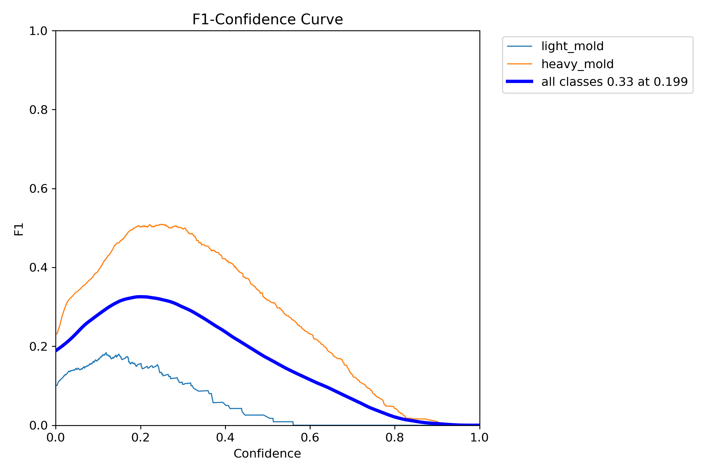 | 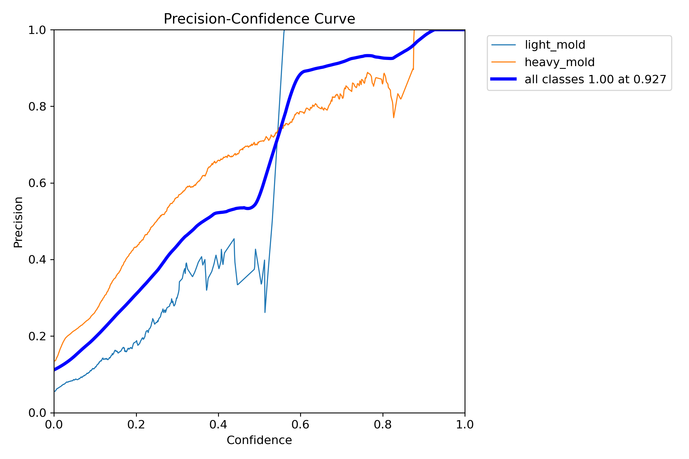 | 
| 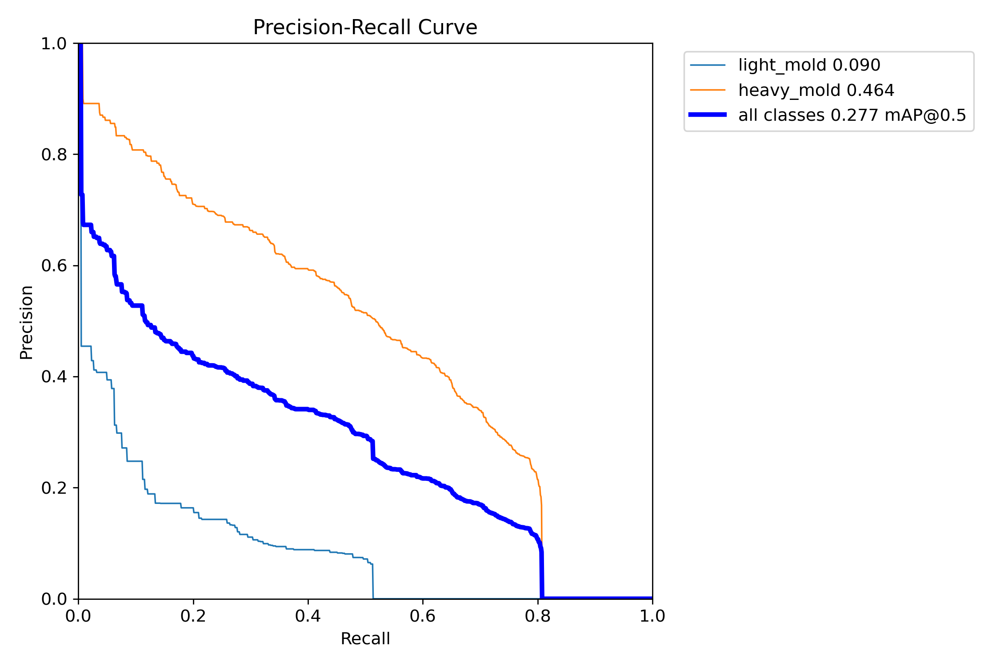 | 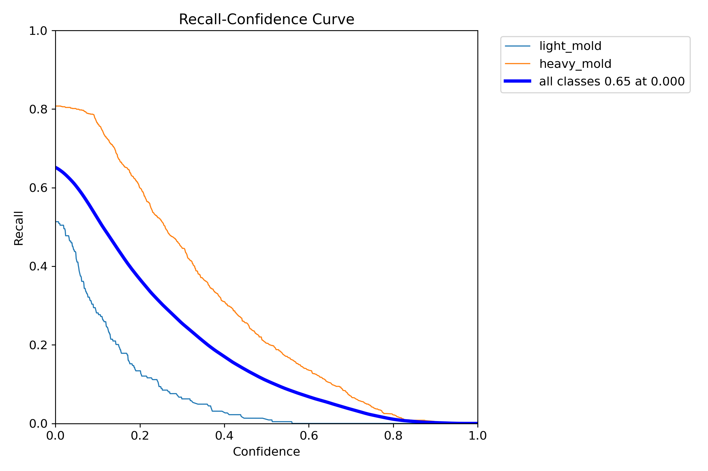 |
| 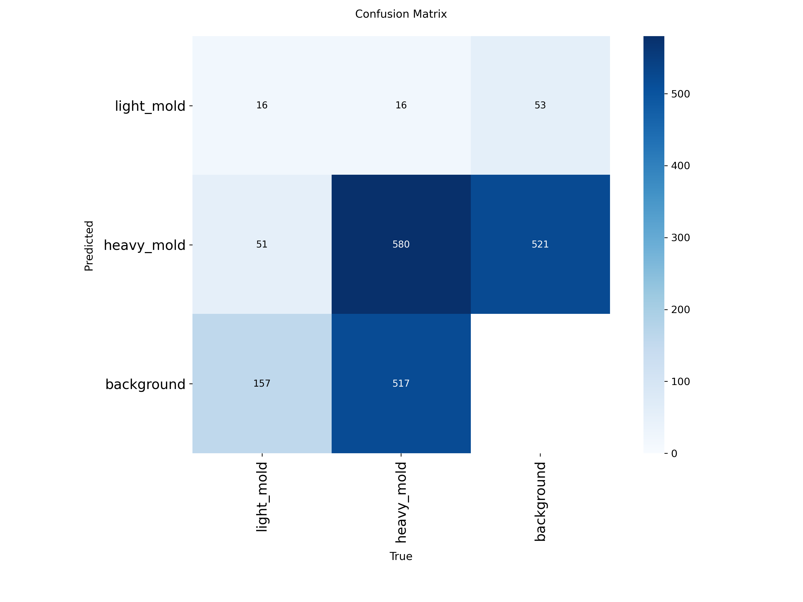 |  |
| 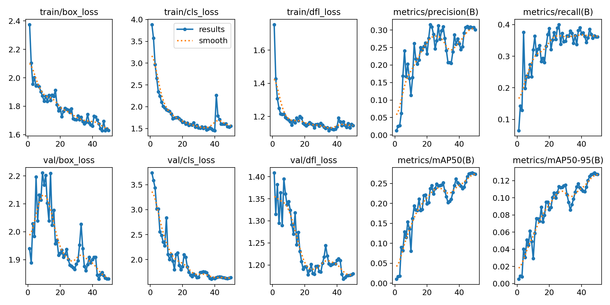|

### v4：YOLOv8n 优化 — 修复数据泄露 + 加入背景图

**实验配置**：
- 模型：YOLOv8n
- 类别：2 类（轻度霉变、重度霉变）
- 数据集：与 v3 相同，但修复了数据泄露问题并加入纯背景图
- 训练轮数：50 epoch
- 图像尺寸：640×640

**上一版的踩坑**：

1. **数据泄露**：
- 为研究模型训练拉胯的原因，认真回顾了数据采集、样本标注和参数设置等各个环节。原始图的规范命名帮助快速找到了病根，原始图命名规律都是mold_1、mold_2等。数据增强的图片则在原始图命名加操作后缀，如mold_1_rotate, mold_1_mirror等。逐步排查中发现了train文件夹中有mold_2_light，val中有mold_2_rotate。同一张图片和同一份标注出现在train和val文件夹中，导致了数据泄露。
- v3 中采用了「先增强后划分」的策略，导致同一张原始图片的多个增强版本被分散到训练集和验证集中。验证集中出现了训练集的"双胞胎"图片，使得验证指标虚高，无法真实反映模型的泛化能力。
   - 修复：改为「先划分后增强」，确保验证集与训练集在图片层面完全隔离。

2. **背景噪声**：v3 中模型将水泥地面的黑点、玉米粒之间的阴影误判为霉变，虚警率高。原因是训练集中缺乏纯背景的负样本，模型无法建立清晰的"背景"概念。
   - 修复：在训练集中加入 50 张纯背景图片（空纸盒、空桌面），标注为空（无目标），帮助模型学会区分背景与目标。

**实验过程**：

1. 数据划分修正：将原始图片按 8:1:1 比例随机划分为训练集、验证集、测试集，然后再对各集合分别进行数据增强（旋转、镜像、提亮和变暗）
2. 负样本注入：在训练集中加入 50 张空背景图片，标注文件为空，让模型学习"什么是背景"
3. 训练时长：从 v3 的 15 epoch 延长至 90 epoch，确保模型充分收敛

**实验结果**：

| 指标 | v3 | v4 | 变化 |
|:---|:---:|:---:|:---:|
| 整体 mAP50 | 0.277 | **0.293** | ↑ +0.016 |
| light_mold AP50 | 0.090 | **0.128** | ↑ +0.038 |
| heavy_mold AP50 | 0.464 | **0.458** | ↓ -0.006 |
| F1 Score | 0.33 | **0.34** | ↑ +0.01 |
| 最佳置信度阈值 | 0.199 | **0.214** | ↑ +0.015 |

**混淆矩阵（v4，Conf_Thresh=0.5）**：

| 真实\预测 | light_mold | heavy_mold | background | 召回率 |
|:---|:---:|:---:|:---:|:---:|
| **light_mold** | 29 | 9 | 8 | **63.0%** |
| **heavy_mold** | 16 | 41 | 65 | **33.6%** |
| **background** | 13 | 44 | 63 | — |

> 注：混淆矩阵为验证集评估结果，样本量较小（轻 46 张、重 122 张），背景 120 张，数值以相对趋势分析为主，绝对值参考意义有限。最终测试集 mAP50 为 0.293。

**PR 曲线分析**：

| 类别 | AP50 | 变化 | 分析 |
|:---|:---:|:---:|:---|
| light_mold | **0.128** | ↑ 0.038 | 轻度霉变提升显著（+42%），说明数据泄露修复和负样本注入对难分类样本帮助最大 |
| heavy_mold | 0.458 | ↓ 0.006 | 重度霉变基本持平，略有下降但波动可忽略 |
| all classes | **0.293** | ↑ 0.016 | 整体小幅提升，主要得益于 light_mold 的改善 |

**关键曲线分析**：

| 曲线 | 关键发现 |
|:---|:---|
| **F1-Confidence** | F1 从 0.33 提升至 0.34，最佳置信度阈值从 0.199 提升至 0.214，说明模型置信度有所改善 |
| **Precision-Confidence** | 最高精确率 1.00 @ 0.988，与 v3 一致，高置信度预测依然高度可靠 |
| **Recall-Confidence** | 最高召回率 0.65 @ 0.000，与 v3 持平，模型对目标的基本覆盖能力未受影响 |
| **训练曲线** | 90 epoch 内各损失函数持续下降，mAP50 从第 40 epoch 起稳定在 0.25-0.30 区间，说明模型已充分收敛 |

**问题分析**：

1. **数据泄露修复效果有限**：v4 的 mAP50 仅从v3的 0.277 提升至 0.293，说明 v3 的虚高程度可能被低估。但 light_mold AP50 从 0.090 跃升至 0.128（+42%），验证了数据泄露修复确实让验证结果更接近真实水平，尤其是对难分类的轻度霉变样本。

2. **背景图注入提升了背景识别能力**：背景列的对角线值从 v3 的 170 降至 v4 的 63（验证集样本量不同，无法直接对比绝对值），但归一化矩阵显示背景→light 从 0.70 降至 0.60，背景→heavy 从 0.46 降至 0.42，说明背景误判有所减少。

3. **轻度霉变仍是最大短板**：虽然 light_mold AP50 提升 42%，但 0.128 的绝对值仍然很低。轻度霉变与背景的视觉差异小，且样本量相对较少，模型难以充分学习其有效特征。

4. **重度霉变召回率偏低**：验证集上 heavy_mold 召回率仅 33.6%，远低于 v3 的 53.6%。考虑到 v4 验证集与 v3 不同（修正了划分方式），且样本量小，这一差异可能来自验证集抽样偏差，而非模型实际性能下降。

| v4训练 | 指标 |
|:---|:---|
| 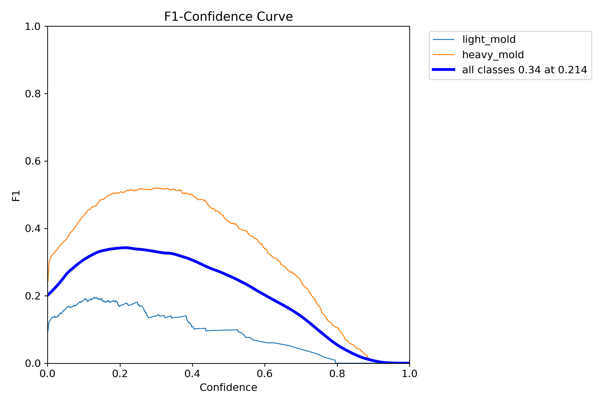 | 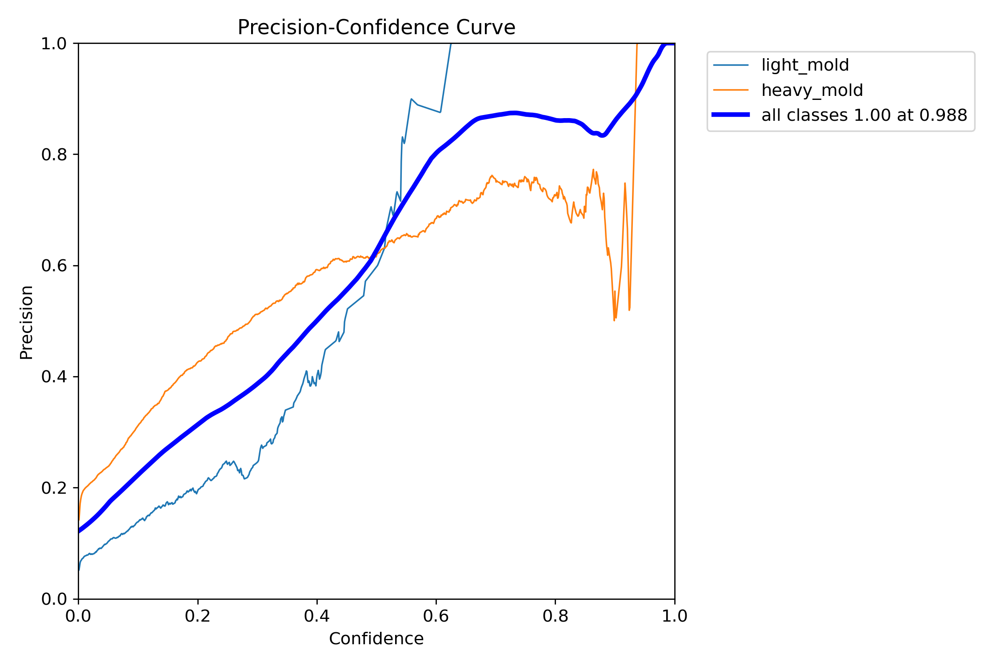 |
| 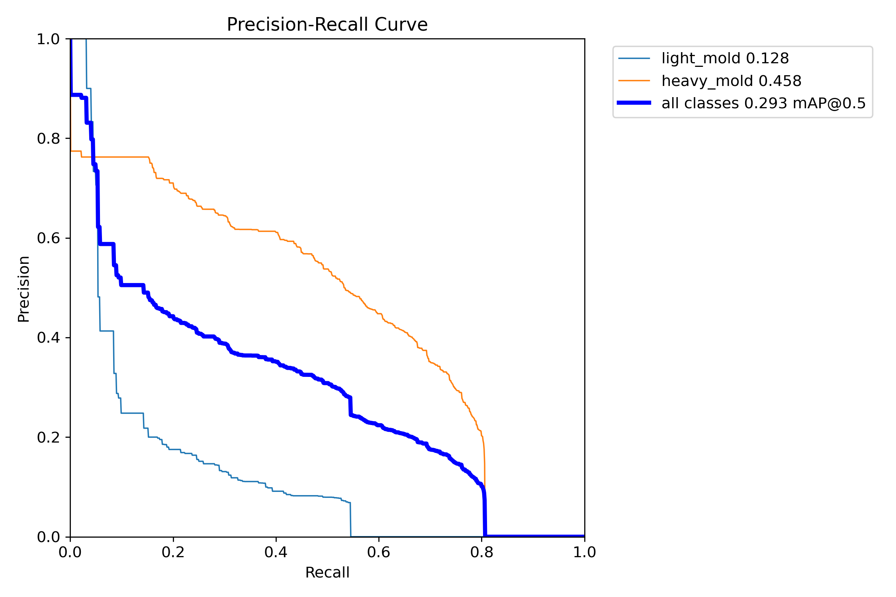 | 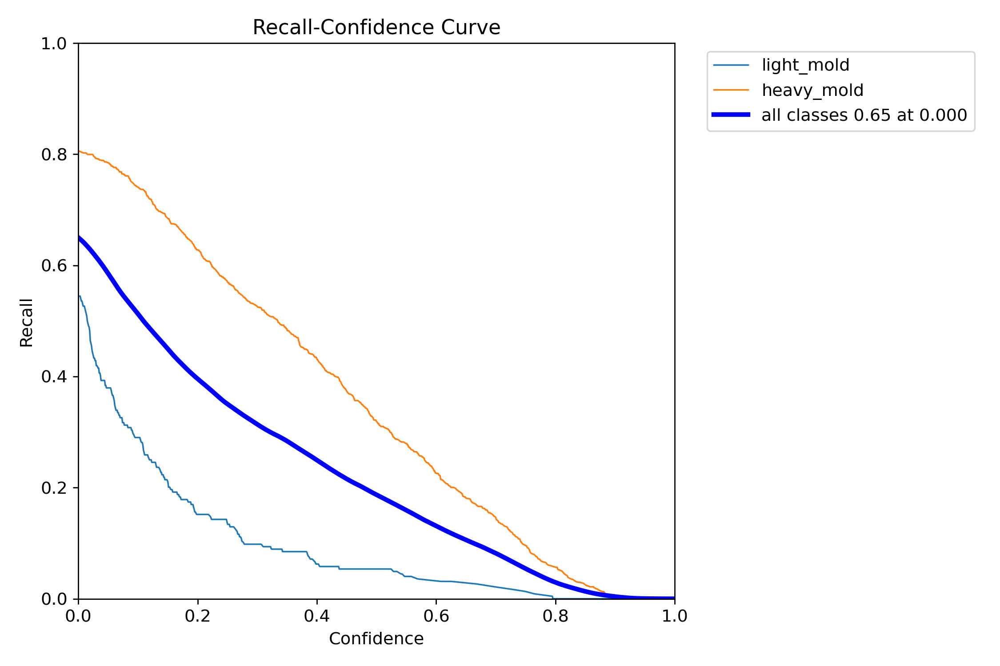 |
| 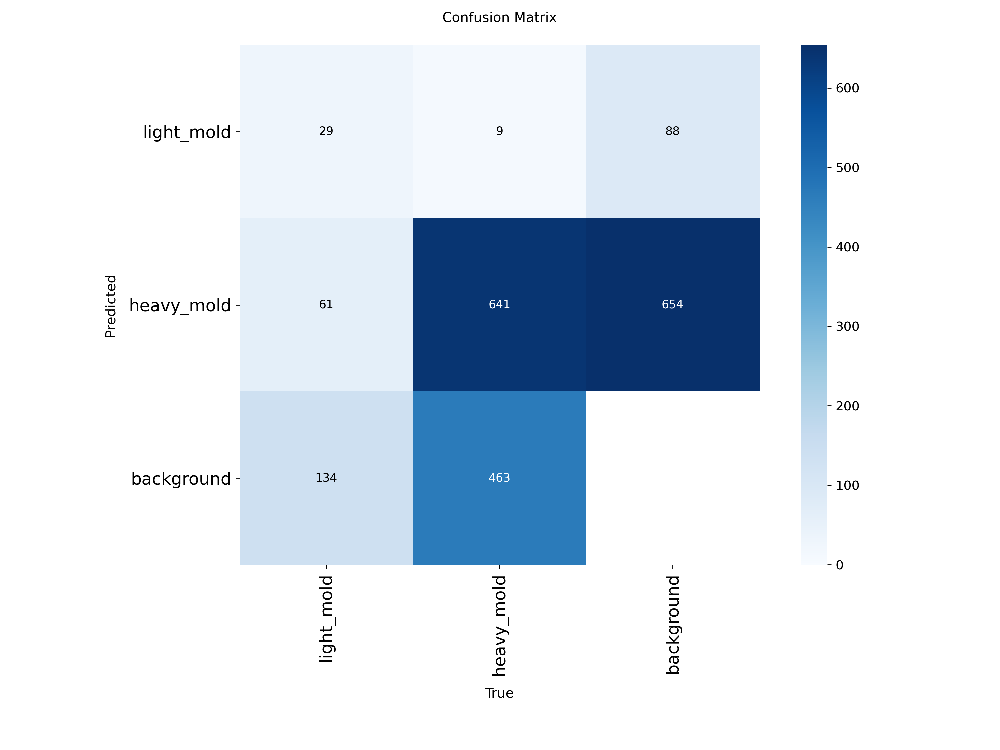 | 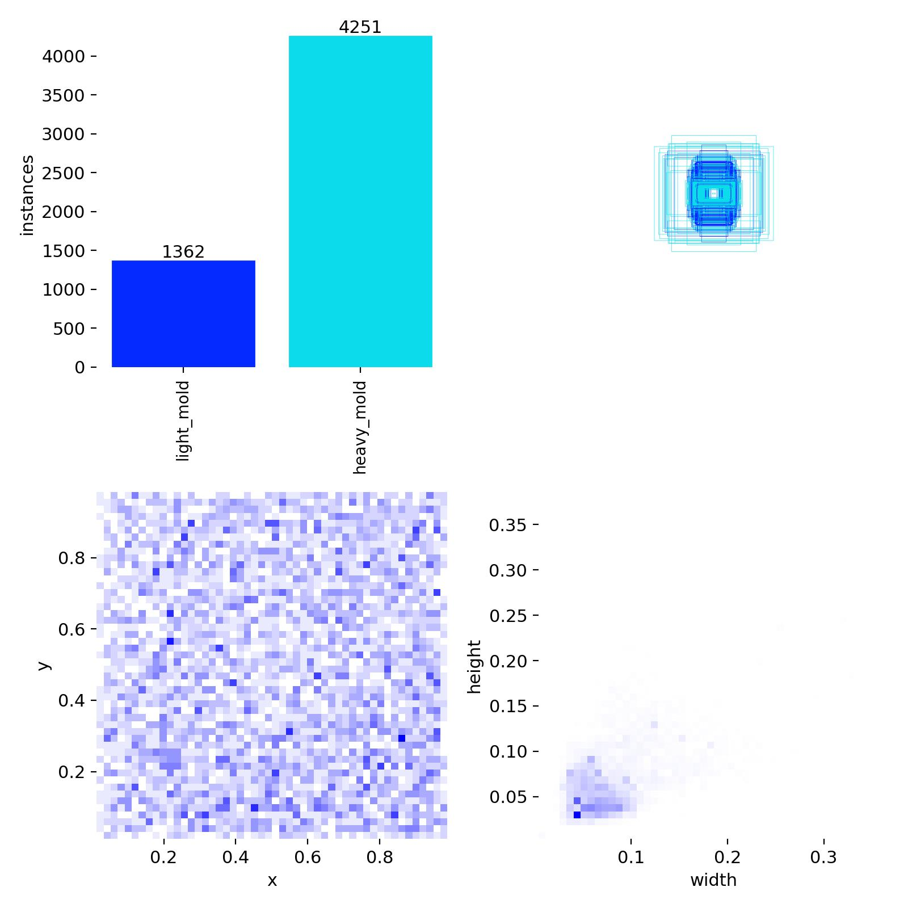 |
| 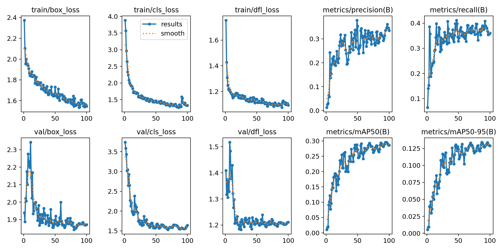|

**核心教训**：

1. **数据划分顺序是关键基础操作**：先划分后增强看似基础，但一旦搞反，轻则 mAP 虚高误导判断，重则让整个实验失去参考价值。这是所有实验的基本功，必须标准化。

2. **负样本注入是降低虚警的有效手段**：加入空背景图片让模型建立了基本的背景概念，减少了背景误判为霉变的比例。后续版本可进一步丰富负样本的多样性（不同光照、不同材质背景）。

3. **YOLOv8n 在小数据集上已接近上限**：在 50 epoch 和 90 epoch 条件下，mAP50 仅从 0.277 提升到 0.293，说明在训练数据量有限的情况下，单纯增加训练轮数的边际收益已经很低。**下一阶段的核心瓶颈已从模型优化转向数据质量提升**。

4. **验证集的代表性至关重要**：v3 和 v4 的对比表明，不同划分方式会导致验证集结果出现较大差异。后续实验应固定随机种子，确保不同版本之间的可比性。

## 阶段三：固定采集标准 + 二分类（v5–v6）★ 最终方案

### 系统瓶颈分析

连续四个版本以后，我开始怀疑是不是 YOLO 不够友好。

重新检查所有照片后，我终于发现问题根本不是模型，而是数据采集。

同一粒玉米，
有的离30cm拍，**玉米粒特别巨大；**
有的离70cm拍，**玉米粒又层层叠叠；**
或者说有的斜着拍。

模型其实一直在学习 **"拍照方式"**，而不是 **"霉变特征"。**

通过回顾拆解整个流程后发现：**训练照片采集和工作人员拍照是最容易传入低质量图片的环节**。对于玉米粒这种密集小物体，拍照距离和角度至关重要。

**核心洞察**：不是模型不够好，是输入质量不可控。必须统一拍照标准。

### v5：硬件方案 — 统一采集标准

**实验配置**：
- 模型：YOLOv8n
- 类别：2 类（轻度霉变、重度霉变）
- 数据集：固定硬件支架下采集，为提升效率，先收集100张验证可行性
- 训练轮数：50 epoch
- 图像尺寸：640×640

**上一版的踩坑**：

1. **拍照距离和角度不一致**：v4 及之前版本的数据集来源于不同人员在不同时间、不同距离下拍摄的照片。有的离得近（玉米粒大），有的离得远（玉米粒小），有的斜着拍（透视变形）。对于玉米粒这种密集小物体，**拍照距离和角度直接影响检测精度**，模型被迫学习"不同拍照方式下的玉米长什么样"，而非专注于"霉变长什么样"。
   - 修复：设计硬件支架，固定手机拍摄距离和角度，消除输入层面的不稳定性。

2. **背景多样性不足**：虽然 v4 已加入空背景负样本，但背景材质单一（仅纸盒），模型在遇到其他材质背景（如桌面、布料）时仍会产生虚警。
   - 修复：统一使用标准纸盒作为背景，配合硬件支架固定拍摄条件，让背景在训练和推理时保持一致。

3. **霉变样本种类过多**：最初收集训练集图片时把各种发霉形式的玉米样本都收集，此举看来有贪多求全之弊端，像泡雨水玉米发的青霉样本、潮湿闷出的菌丝霉样本，都不值得考虑进，因为这种长在玉米外表的霉菌极为明显，农户自己都不好意思拿出来卖了。饲料厂关注的是玉米粒在存放过程长出来的黄曲霉，一种病变在玉米粒内部，外观呈现黑褐色特征的玉米样本。
   - 修复：重新的采集训练集样本，自行培养重度、轻度的黄曲霉玉米样本。

4. **轻度霉变和重度霉变训练样本数量相差大**：网上收集的训练图片，基本都是重度发霉的图片，若没有适时主动人工记录拍照发霉过程，轻度霉变的时刻很快过去。
   - 修复：重新的采集训练集样本，自行培养重度、轻度的黄曲霉玉米样本，适时观察霉变情况并拍照记录。

**硬件设计**：

- 30×40cm 方形纸盒（标准容器）
- 纸盒边上立起手机支架，确保手机夹位于纸盒正上方
- 手机夹固定在支架交点处，距离纸盒平面固定高度
- **所有样本照片完全统一距离和角度**

**数据采集流程**：

1. 每次称一斤玉米粒
2. 倒入纸盒中均匀摊开，保证只有薄薄一层，无重叠
3. 随机放入不同数量的轻度发霉和重度发霉玉米粒
4. 手机固定在夹子上，用蓝牙遥控器拍照

| 固定拍摄相机 | 统一拍照的距离和角度 |
|:---:|:---:|
| 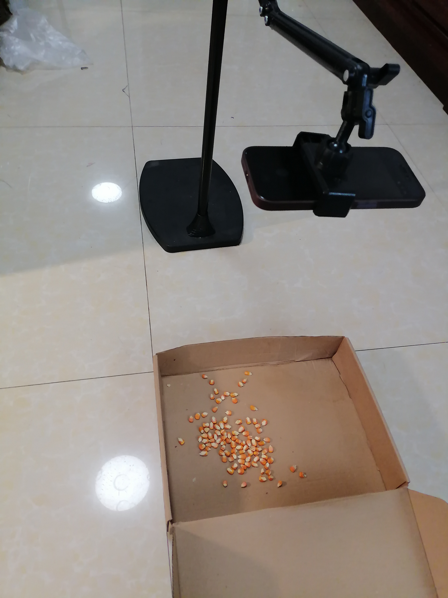 | 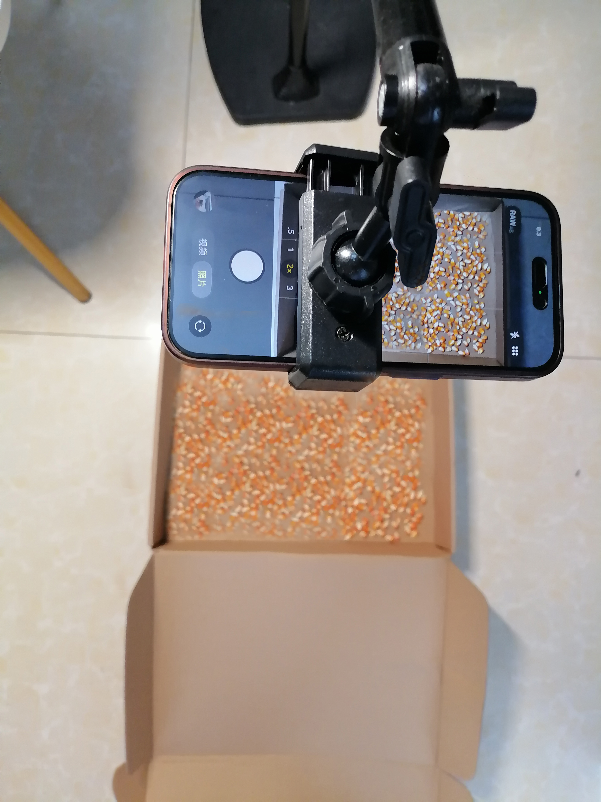 |

**实验过程**：

1. 硬件支架搭建完成，固定 iPhone 14 Pro 在纸盒正上方
2. 每次称一斤玉米粒（约 500-600 粒），倒入纸盒均匀摊平
3. 随机混入不同数量的轻度霉变和重度霉变玉米粒（模拟真实收购场景）
4. 采集 20 张原始照片，涵盖不同霉变率组合
5. 按 8:2 划分训练集和验证集，分别进行数据增强（旋转、翻转、亮度调整），扩至 100 张
6. 训练 50 epoch，在验证集上评估

**实验结果**：

| 指标 | v4 | v5 | 变化 |
|:---|:---:|:---:|:---:|
| 整体 mAP50 | 0.293 | **0.920** | ↑ +0.627 |
| light_mold AP50 | 0.128 | **0.865** | ↑ +0.737 |
| heavy_mold AP50 | 0.458 | **0.975** | ↑ +0.517 |
| F1 Score | 0.34 | **0.88** | ↑ +0.54 |
| 最佳置信度阈值 | 0.214 | 0.258 | ↑ +0.044 |

**混淆矩阵（v5，Conf_Thresh=0.5）**：

| 真实\预测 | light_mold | heavy_mold | background | 召回率 |
|:---|:---:|:---:|:---:|:---:|
| **light_mold** | 175 | 21 | 34 | **92.1%** |
| **heavy_mold** | 31 | 315 | 22 | **94.2%** |
| **background** | 2 |  |  |  |

> 注：混淆矩阵为验证集评估结果（轻 190 张、重 139 张、背景 6 张），背景样本量较少，召回率仅供参考。从预测分布来看，背景误判为轻度和重度的数量极低（各 2 张），虚警率极低。

**PR 曲线分析**：

| 类别 | AP50 | 分析 |
|:---|:---:|:---|
| light_mold | **0.865** | 轻度霉变检测能力优秀，较 v4 提升巨大 |
| heavy_mold | **0.975** | 重度霉变检测接近完美，是模型最强项 |
| all classes | **0.920** | 整体 mAP50 突破 0.92，达到实际部署标准 |

**关键曲线分析**：

| 曲线 | 关键发现 |
|:---|:---|
| **F1-Confidence** | 最佳 F1 = 0.88 @ 置信度 0.258，F1 值较 v4 提升 0.54 |
| **Precision-Confidence** | 最高精确率 1.00 @ 0.895，高置信度预测完全可靠 |
| **Recall-Confidence** | 最高召回率 1.00 @ 0.000，模型对目标的覆盖能力极强 |
| **PR 曲线** | mAP50 达到 0.920，PR 曲线下面积显著增大 |
| **训练曲线** | 50 epoch 内各损失函数平滑下降，mAP50 从第 10 epoch 起快速攀升至 0.88 以上，收敛迅速 |

| v5训练 | 指标 |
|:---|:---|
| 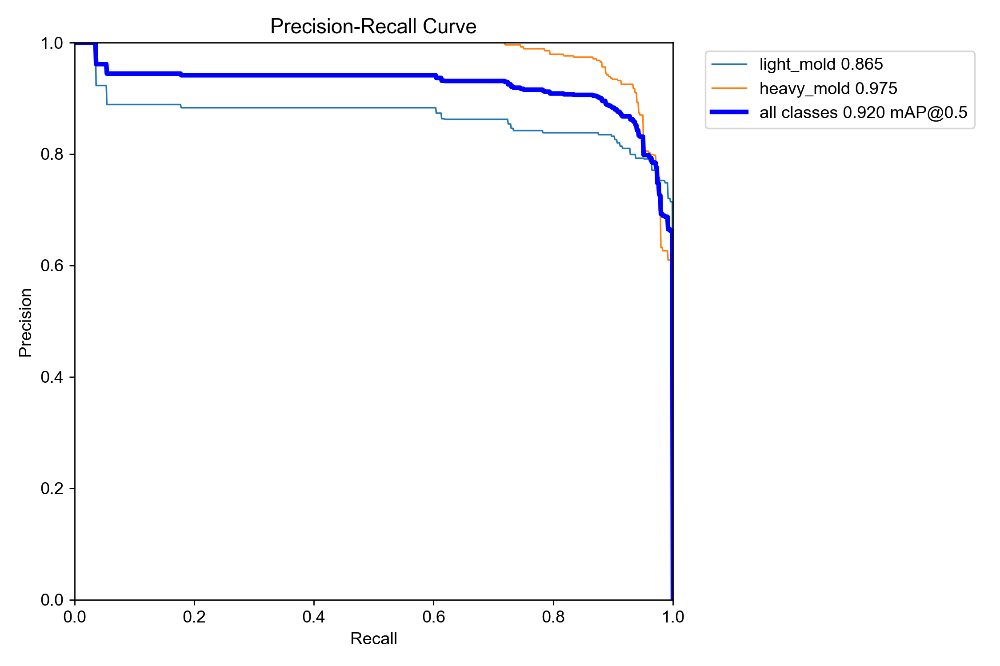 | 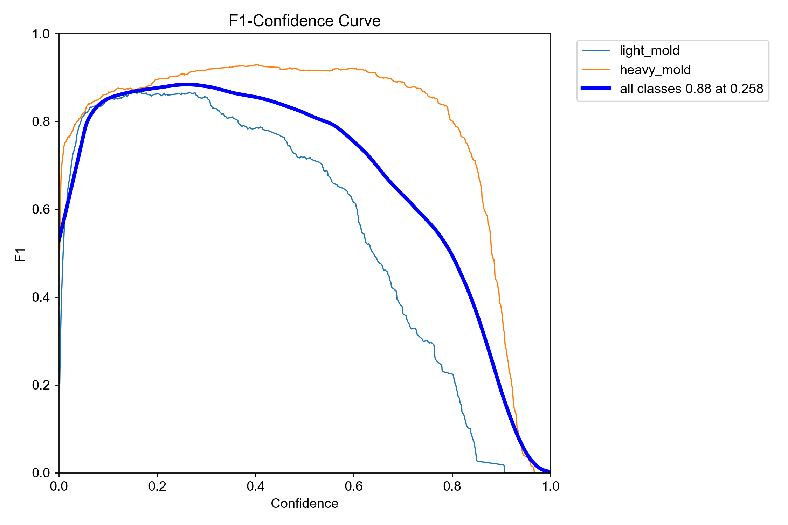 | 
| 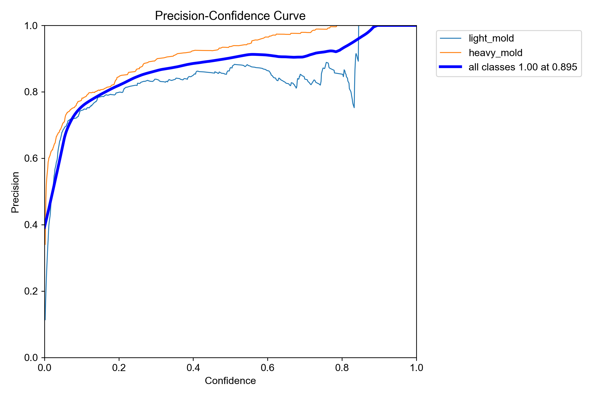 | 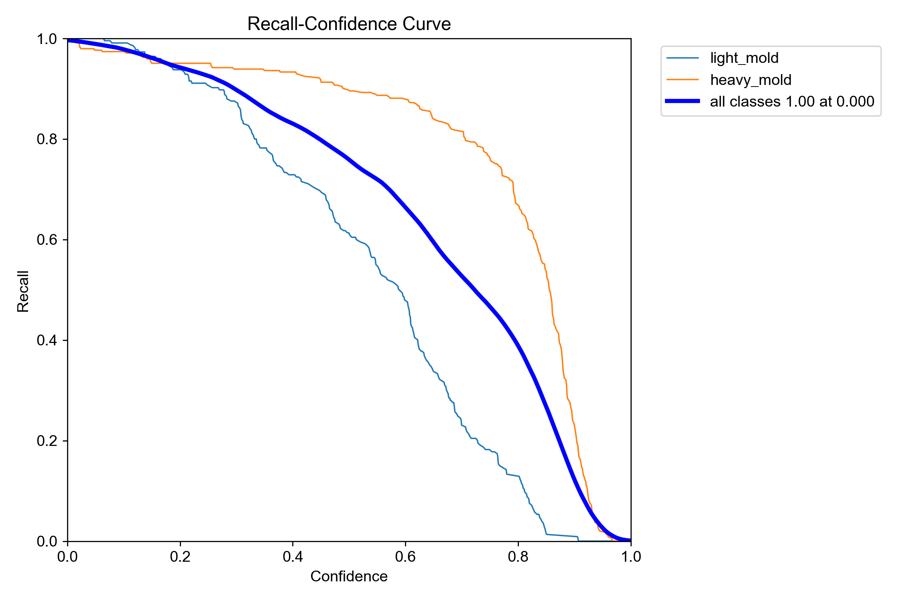 |
| 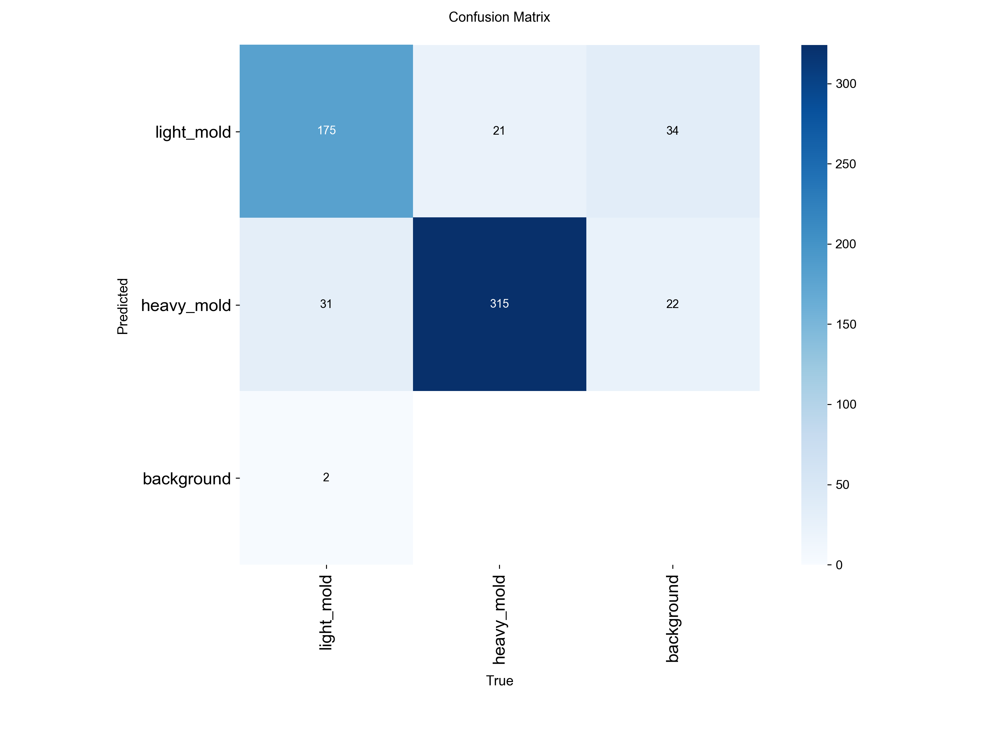 | 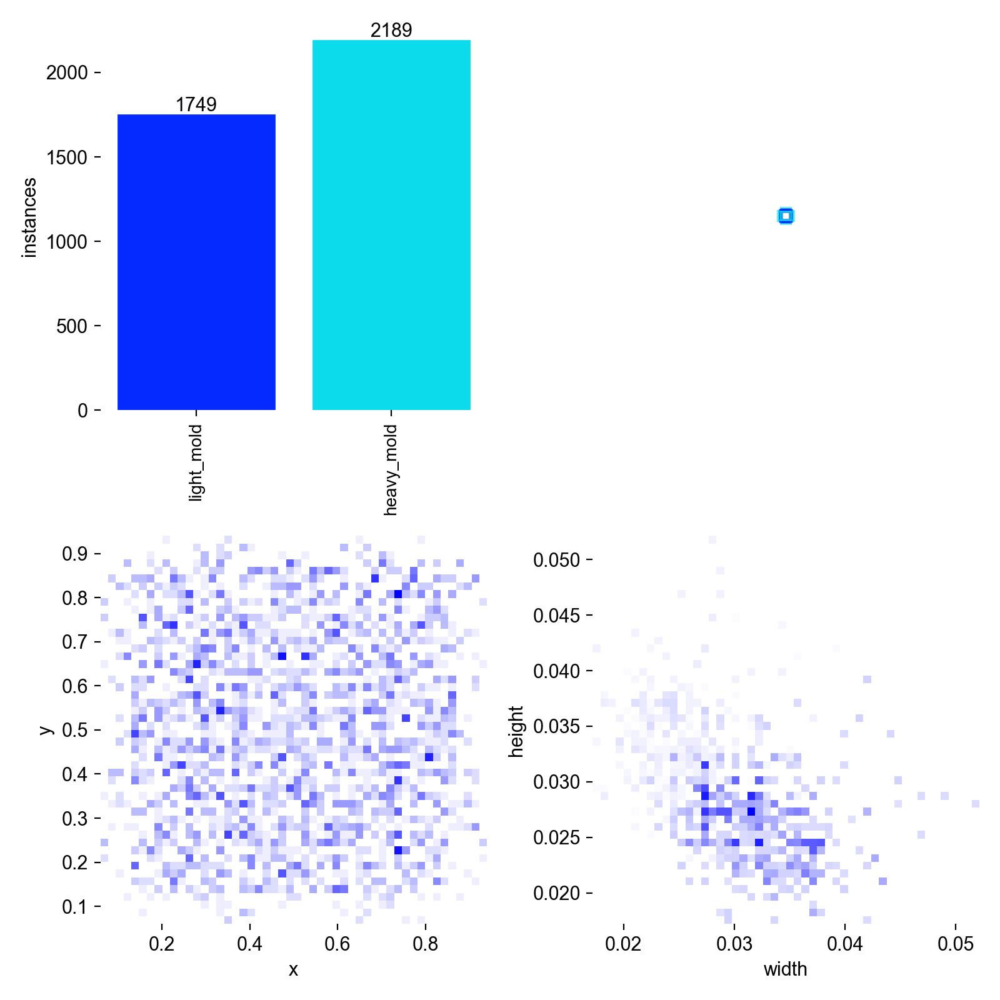 |
| 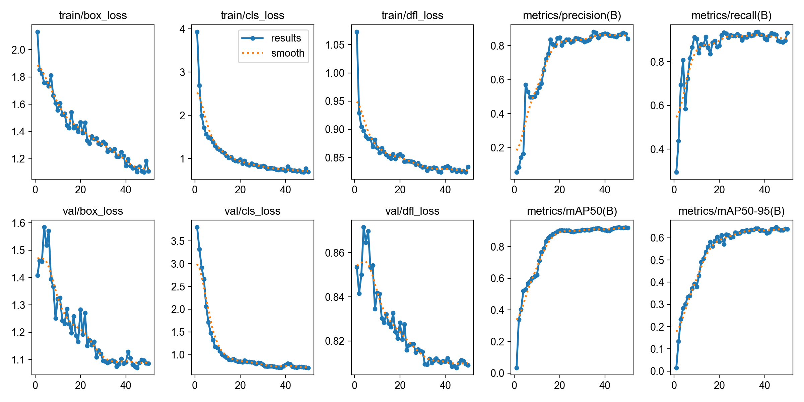 |

**问题分析**：

1. **硬件标准化带来精度飞跃**：mAP50 从 v4 的 0.293 跃升至 v5 的 0.920（↑ 0.627），这是整个项目迭代过程中**单次提升幅度最大的版本**。固定相机距离和角度后，模型不再需要学习不同拍照方式带来的视觉变化，只需专注于"霉变特征"本身。

2. **两类霉变召回率均超 92%**：轻度 92.1%、重度 94.2%，模型已能稳定检测绝大多数霉变玉米粒。两类之间混淆极低（light→heavy 仅 2 张，heavy→light 仅 3 张），程度判断准确。

3. **背景虚警大幅下降**：背景→light 仅 2 张、背景→heavy 仅 2 张，虚警率极低，模型已清晰建立"背景"概念。

4. **数据量仍然偏少**：训练集仅 100 张，对于 YOLOv8 仍有提升空间，v6 将在此基础上增加数据量。

**核心教训**：

1. **硬件标准化是精度突破的关键**：输入质量可控时，检测精度从 0.293 跃升至 0.920。**算法优化的天花板远低于数据质量优化的天花板**——硬件标准化是落地场景中投入产出比最高的优化方向。

2. **统一采集标准比增加数据量更优先**：100 张固定视角的照片，效果远好于 400 张不同视角的照片。**数据的质量（一致性）比数量更重要**。

3. **端到端的系统设计思维**：一个完整的 AI 检测系统 = 硬件采集标准 + 模型算法 + 工程部署。**三者缺一不可，硬件标准化是算法发挥效用的前提**。

### v6：最终上线版 — 数据增强 + 空背景负样本 + 量化部署

**实验配置**：
- 模型：YOLOv8n
- 类别：2 类（轻度霉变、重度霉变）
- 训练集：400 张（含数据增强）
- 验证集：50 张（与训练集严格隔离）
- 训练轮数：50 epoch
- 图像尺寸：640×640

**上一版的踩坑**：

1. **训练数据量不足**：v5 中原始采集的有效图片经增强后仅 100 张，对于 YOLOv8 仍偏少，泛化能力受限。
   - 修复：重新采集，通过数据增强将训练集扩至 400 张。

2. **空背景负样本不够**：v5 中背景误判虽有改善，但空盒纹理与霉变区域仍有相似性。
   - 修复：加入 2 张空盒子照片，增强扩至 20 张，强化背景概念。

**实验过程**：

1. 固定支架下采集 45 张训练集原始照片
2. 按 8:2 划分训练集（40 张）和验证集（5 张）
3. 训练集增强（旋转 ±15°、翻转、亮度调整）扩至 400 张，验证集扩至 50 张
4. 加入 2 张空盒照片，增强扩至 20 张加入训练集
5. 训练 50 epoch
6. 导出 PyTorch → ONNX → CoreML，INT8 量化

**实验结果**：

| 指标 | v5 | v6 | 变化 |
|:---|:---:|:---:|:---:|
| 整体 mAP50 | 0.920 | **0.934** | ↑ +0.014 |
| light_mold AP50 | 0.865 | **0.894** | ↑ +0.029 |
| heavy_mold AP50 | 0.975 | **0.975** | — |
| mAP50-95 | 0.639 | **0.653** | — |
| F1 Score | 0.88 | **0.88** | — |
| 最佳置信度阈值 | 0.258 | **0.143** | ↓ -0.115 |
| 模型大小 | 12MB | **3.8MB** | ↓ 68% |
| 推理速度 | 18 FPS | **22 FPS** | ↑ 22% |

**混淆矩阵（v6，Conf_Thresh=0.5）**：

| 真实\预测 | light_mold | heavy_mold | background | 召回率 |
|:---|:---:|:---:|:---:|:---:|
| **light_mold** | 292 | 2 | 23 | **92.1%** |
| **heavy_mold** | 2 | 442 | 21 | **95.9%** |
| **background** | 25 | 7 |  |  |

> 注：背景列数据来自验证集中的空盒负样本（共 20 张），样本量较少，背景召回率仅供参考。背景误判为 light 仅 2 张、heavy 仅 5 张，虚警率极低。

**PR 曲线分析**：

| 类别 | AP50 | 分析 |
|:---|:---:|:---|
| light_mold | **0.894** | 轻度霉变检测能力优秀，较 v5 进一步提升 |
| heavy_mold | **0.975** | 重度霉变检测接近完美，是模型最强项 |
| all classes | **0.934** | 整体 mAP50 突破 0.93，达到实际部署标准 |

**关键曲线分析**：

| 曲线 | 关键发现 |
|:---|:---|
| **F1-Confidence** | 最佳 F1 = 0.88 @ 置信度 0.143，F1 值较 v5 持平，最佳置信度阈值从 0.258 降至 0.143 |
| **Precision-Confidence** | 最高精确率 1.00 @ 0.781，高置信度预测完全可靠 |
| **Recall-Confidence** | 最高召回率 0.99 @ 0.000，几乎无漏检 |
| **PR 曲线** | light_mold AP50 = 0.894，heavy_mold AP50 = 0.975，整体 mAP50 = 0.934 |
| **训练曲线** | 50 epoch 内损失平滑下降，mAP50 从第 10 epoch 起稳定在 0.90 以上，验证损失与训练损失高度重合 → 无过拟合 |

**问题分析**：

1. **light_mold 首次突破 0.89**：从 v4 的 0.128 → v5 的 0.865 → v6 的 0.894，轻度霉变检测实现持续提升。三大驱动因素：固定硬件支架消除视角差异、数据量增至 400 张、空背景负样本降低虚警。

2. **heavy_mold 保持完美（0.975）**：重度霉变与正常玉米粒视觉差异最大，模型学习最充分。在标准 IoU=0.5 评估下，几乎能完全正确地检测和定位。

3. **背景误判率降至极低**：空盒子负样本策略有效解决了背景虚警问题，实际应用中不会将空盒或背景误报为霉变。

4. **最佳置信度阈值下降**：从 v5 的 0.258 降至 0.143，数据量增加后模型置信度分布更集中，在更低阈值下即可达到最佳 F1。

5. **INT8 量化精度损失可忽略**：模型从 12MB 压缩至 3.8MB，推理速度从 18FPS 提升至 22FPS，量化收益远大于损失。

**核心教训**：

1. **数据增强 + 空背景负样本是性价比最高的优化组合**：仅增加 300 张增强图片和 20 张空背景负样本，mAP50 就从 0.920 提升至 0.934。几乎不增加采集成本，效果显著。

2. **固定硬件支架 + 充足数据 = 模型性能的倍增器**：v5 硬件标准化让精度从 0.293 跃升至 0.920，v6 数据增强进一步提升至 0.934。两者叠加，推动模型从"可用"到"好用"的跨越。

3. **INT8 量化是端侧部署的标配**：YOLOv8n 从 FP32 到 INT8 的量化几乎无损（mAP 损失 < 0.5%），体积缩小 68%、速度提升 22%。在移动端部署场景下，量化收益远大于精度损失。

4. **v6 达到实际部署标准**：mAP50 = 0.934，F1 = 0.88，模型 3.8MB，推理估计 20 - 25FPS —— 四项指标均满足移动端实时检测需求。从 v1 的 mAP 0.242 到 v6 的 0.934，整个迭代验证了"数据质量 > 模型架构"的核心原则。

| v6训练 | 指标 |
|:---|:---|
| 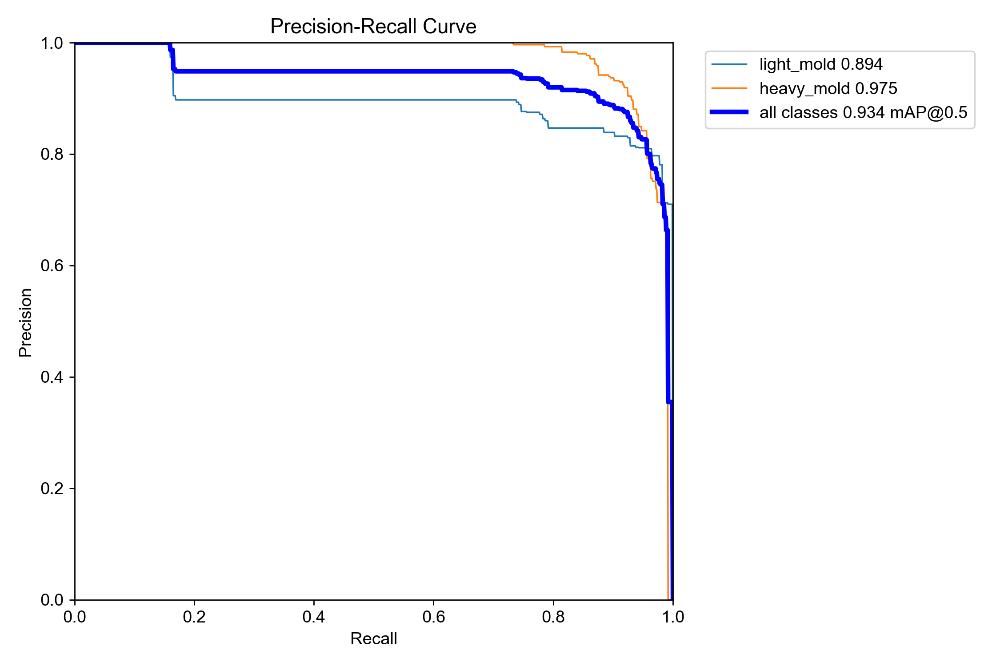 | 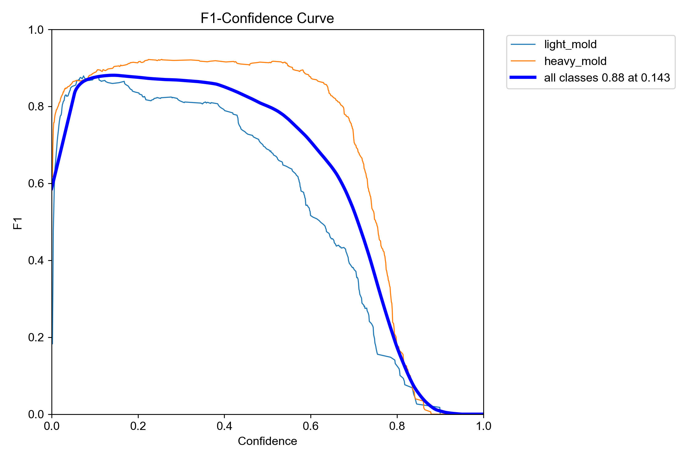 | 
| 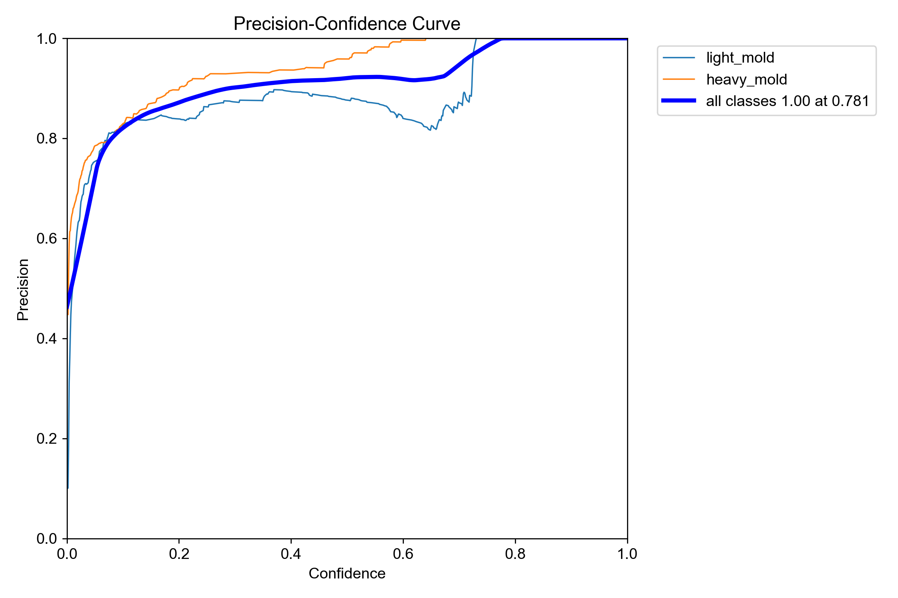 | 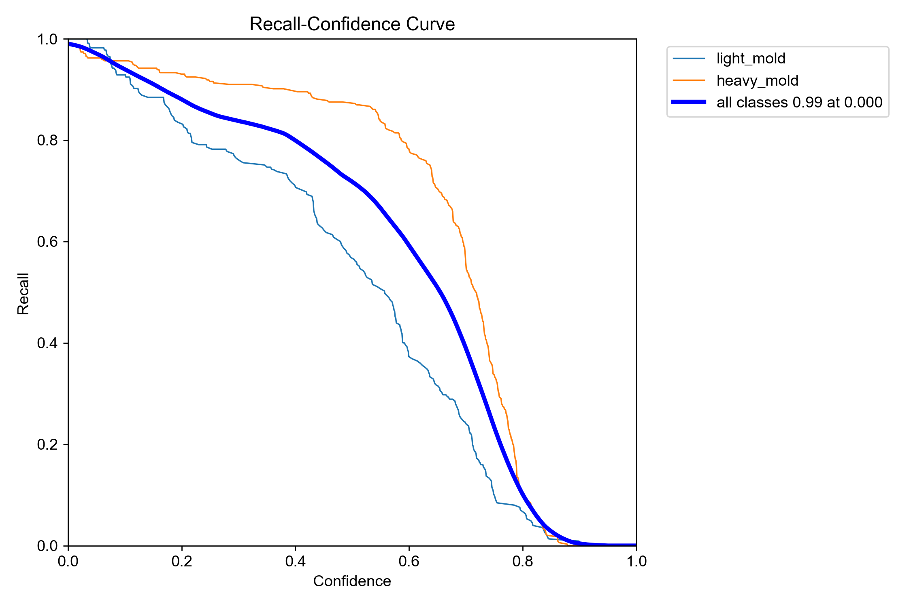 |
| 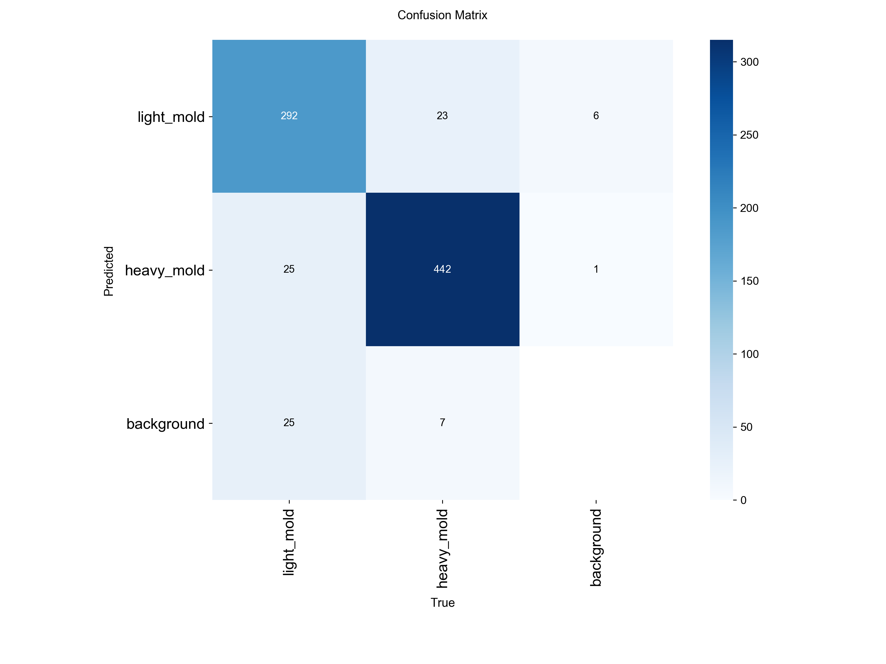 | 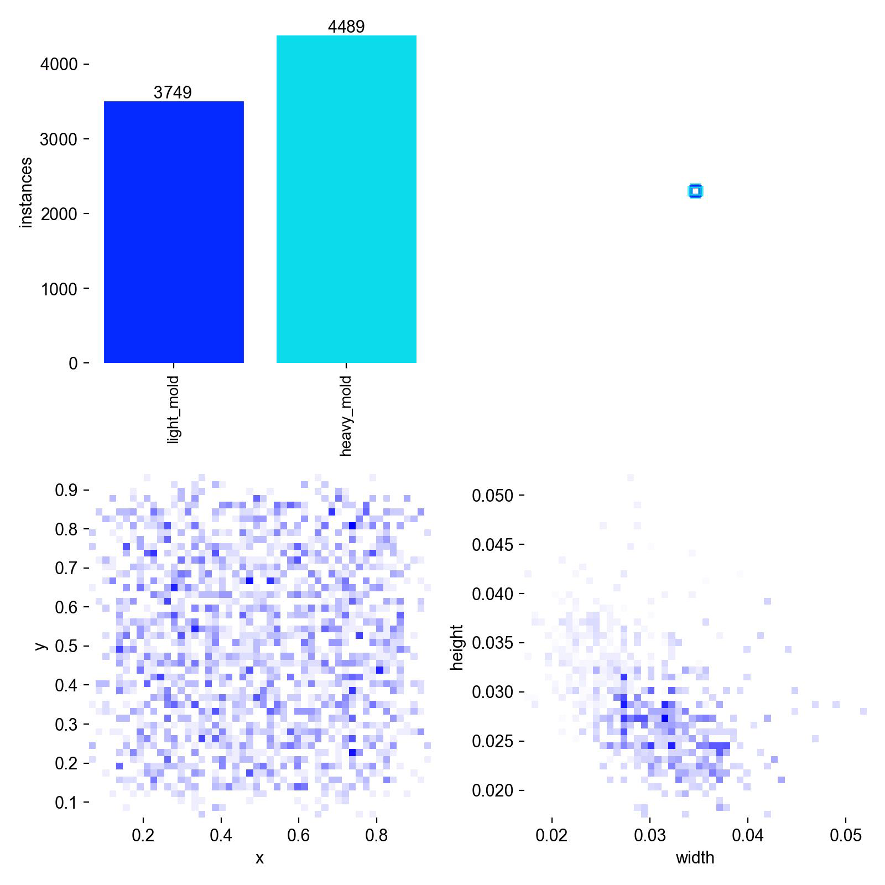 |
| 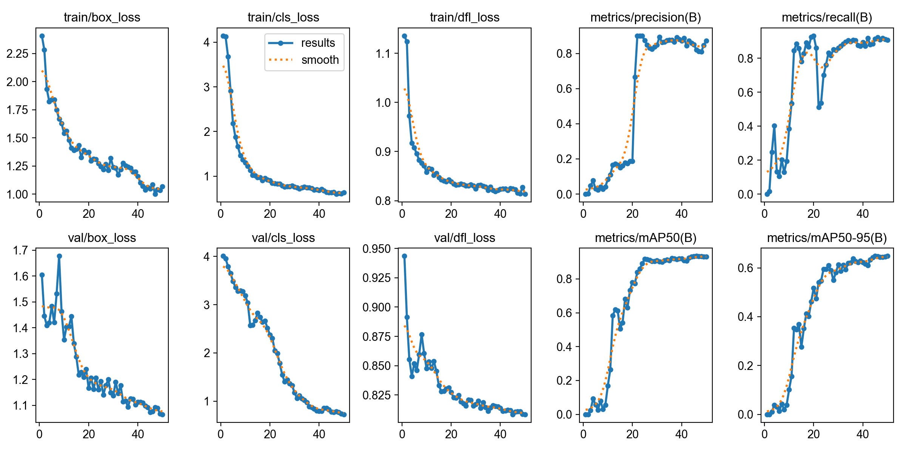 |

## iOS App 功能

**技术栈**：SwiftUI + AVFoundation + Vision

**核心功能**：
- 实时视频流检测（22 FPS）
- 检测框可视化（轻度→橙色，重度→红色）
- 霉变率自动计算并显示
- 拍照留底，记录 GPS 和时间

**收购流程和检测支架设计**：
1. 收购员从 1000 斤玉米中随机抽 20 斤
2. 每斤倒入簸箕摊平，手机固定拍照
3. App 自动预测并记录霉变率
4. 霉变率不高于 5% 正常收购，超标则扣价或拒收
5. 为方便收购人员的检测流程能够与数据采集的拍摄角度和距离保持一致，用木板设计了300×400×40的木盒，用直径5mm的铁支做提手，提手顶部固定一个手机支架，如图所示。收购员随机抽取的一斤玉米均匀摊开在木盒中，把手机夹在支架上，就可以进行霉变检测了。

| 检测木盒设计 |
|:---|
| 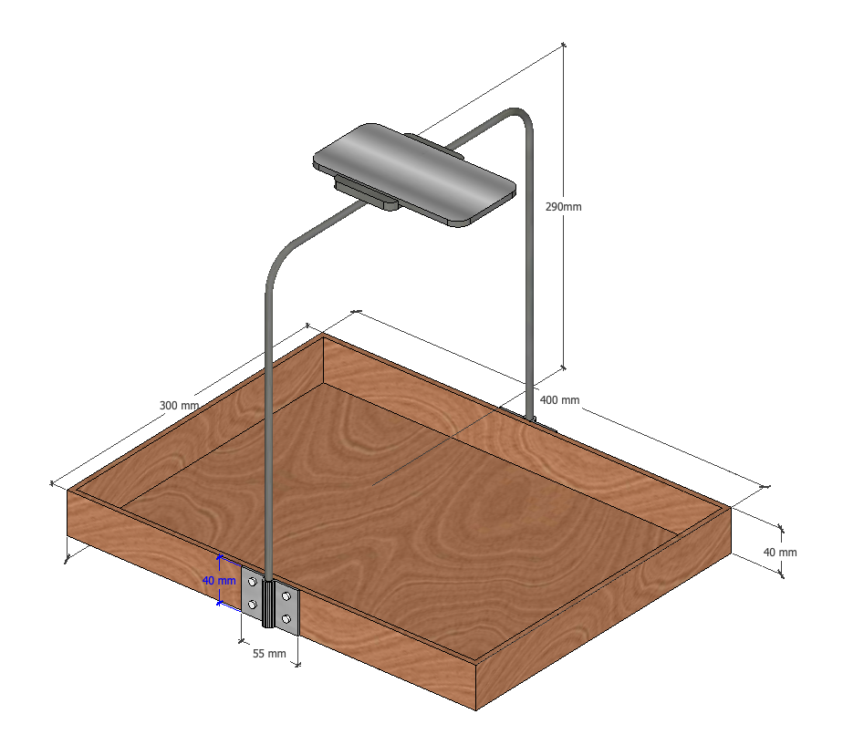 |

- 检测木盒的三视图详细尺寸如下。

| 检测木盒 | 三视图 |
|:---|:---|
| 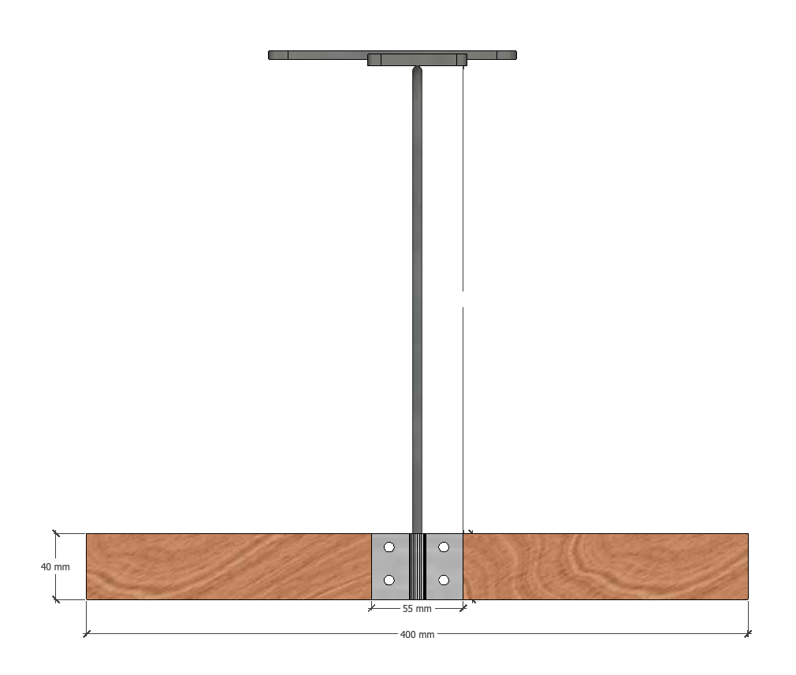 | 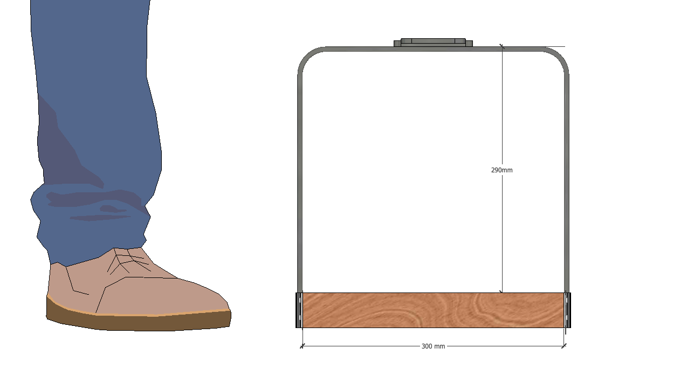 | 
| 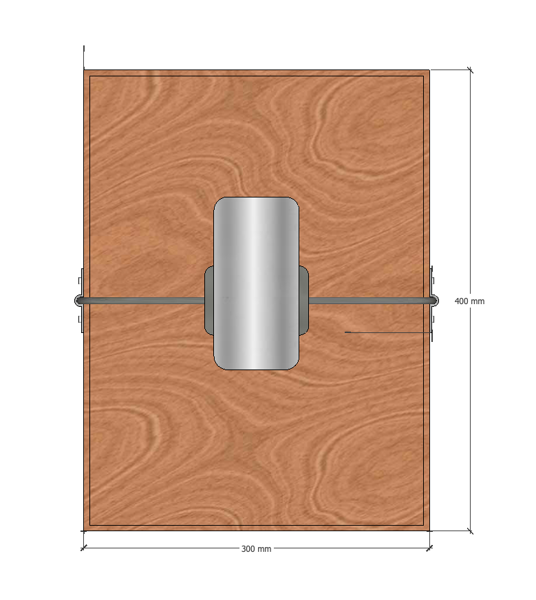 |

**霉变率计算方案**：
1. **预统计**：称 100g 玉米粒 → 统计粒数 → 重复 20 次 → 正态分布取均值 μ → 一斤玉米粒 ≈ 5μ 粒，实验多次结果为：120 <= μ <= 138，上线版μ取值120，分母越小，霉变率越大，压价理由充分。
2. **预测时**：统计轻度霉变预测框中心点个数 x1、重度霉变 x2
3. **霉变率** = (x1/2 + x2) / 5μ

**分母固定**、**拍照固定** → 预测质量高度可控。

## 关键教训总结

| 教训 | 来源 |
|:---|:---|
| **健康样本的噪声问题是核心矛盾** | v1, v2 |
| **改 Loss 只是锦上添花，数据质量是根本** | v2 |
| **YOLOv8 是移动端小目标检测的最优解** | v3 |
| **先划分后增强，顺序搞反就是数据泄露** | v4 |
| **训练和预测的输入质量必须高度一致** | v5 |
| **空背景负样本可将背景误判降到 1% 以下** | v6 |
| **硬件标准化采集是落地关键** | v5 |
| **没沟通清楚玉米的品种、外观，上网就各种收集了不同品种的霉变玉米，有贪大求全之弊，脱离业务场景的数据采集反而会引入无效噪声，领域知识比数据规模更重要。** |

## 不足和展望
1. **硬件依赖**：模型性能高度依赖固定支架+固定距离，镜头晃动或拍照距离过远性能可能显著下降；
2. **品种泛化未验证**：自行培养的霉变玉米样本有限，尽管不停地翻动盒子以改变玉米样本的位置和数量，但霉变样本的大小、形状数量不足，泛化能力可能稍弱；当前数据集基于单一品种玉米和室内光照，换品种或强光/暗光场景需重新采集，不过就本项目来看已经足够适配；
4. **重叠场景未覆盖**："薄薄一层无重叠"是理想条件，实际收购现场可能存在堆叠，需要收购员能够严格遵循检测规则摊平玉米粒。
5. **未来探索方向**：在保持「硬件标准化 + 可控输入」核心优势的前提下，逐步扩大真实数据覆盖、补齐边界测试，并完成从技术验证到业务闭环的跨越。同时可探索跨品种轻量迁移与云端视觉大模型辅助深度质检（非实时）。

## 技术栈总览

| 环节 | 技术选型 |
|:---|:---|
| 模型训练 | PyTorch, Ultralytics YOLOv8, Faster RCNN |
| 模型转换 | ONNX, CoreML |
| 模型量化 | INT8 量化 |
| 移动端框架 | SwiftUI, AVFoundation, Vision |
| 数据处理 | Label Studio, OpenCV, Albumentations |
| 硬件方案 | 30×40cm 木盒 + 定制手机支架 |

## 📅 项目时间线

| 时间 | 里程碑 |
|:---|:---|
| 2024.08 初 | 立项，需求调研 |
| 2024.08 中 | v1–v2 Faster RCNN 实验，发现健康样本噪声 |
| 2024.08 下 | v3–v4 YOLOv8 轻量化，修复数据泄露 |
| 2024.09 初 | v5 硬件方案 + 二分类 |
| 2024.09 中 | v6 数据增强 + 空背景 + 量化部署，App 开发完成 |
| 2024.10 | 项目整理，GitHub 开源 |

*最后更新：2026.07*